In the beginning, I would like to say "Happy New Year!" to all readers who are reading this blog. Life in 2020 is not easy. Since the start of this year, under the dark cloud of the COVID-19 coronavirus pandemic, social unrest exploded following the killing of an African American man, George Floyd; A massive explosion shattered Beirut, Lebanon; An unfortunate helicopter crash killed Kobe Bryant, one of my favorite basketball players. We are all experiencing troubles, discomfort, stress, and anxiety from our families and society, but it makes all of us feel connected more than ever!

2021 is coming, a brand new year! Everything will be fine soon. Let's look ahead!

## Introduction

Chinese Tradition of giving red packets

Chinese New Year is the best day for Chinese kids! It's no exaggeration to say red packets they get from their elders are the majority of their "income" of the year, so every kid is waiting for the special day! Little Tom is one of them, and he typically receives red packets from four groups of people every year. It conforms with **a certain pattern**. For example, there's a chance of 60% that his parents would give him an envelope containing 1000 RMB, 30% for 700 RMB, and 10% for 400 RMB. Other groups would give the same amount of money with different probabilities.

<table><tbody><tr><td class="has-text-align-center" data-align="center"><strong>Givers\Money(RMB)</strong></td><td class="has-text-align-center" data-align="center">1000</td><td class="has-text-align-center" data-align="center">700</td><td class="has-text-align-center" data-align="center">400</td></tr><tr><td class="has-text-align-center" data-align="center">Parents</td><td class="has-text-align-center" data-align="center">60%</td><td class="has-text-align-center" data-align="center">30%</td><td class="has-text-align-center" data-align="center">10%</td></tr><tr><td class="has-text-align-center" data-align="center">Grandparents</td><td class="has-text-align-center" data-align="center">40%</td><td class="has-text-align-center" data-align="center">50%</td><td class="has-text-align-center" data-align="center">10%</td></tr><tr><td class="has-text-align-center" data-align="center">cousins</td><td class="has-text-align-center" data-align="center">20%</td><td class="has-text-align-center" data-align="center">50%</td><td class="has-text-align-center" data-align="center">30%</td></tr><tr><td class="has-text-align-center" data-align="center">Other relatives</td><td class="has-text-align-center" data-align="center">10%</td><td class="has-text-align-center" data-align="center">30%</td><td class="has-text-align-center" data-align="center">60%</td></tr></tbody></table>

Table 1 : probability for pocket money from givers

<table><tbody><tr><td class="has-text-align-center" data-align="center"><strong>Givers</strong></td><td class="has-text-align-center" data-align="center"><strong>Number</strong></td></tr><tr><td class="has-text-align-center" data-align="center">Parents</td><td class="has-text-align-center" data-align="center">2</td></tr><tr><td class="has-text-align-center" data-align="center">Grandparents</td><td class="has-text-align-center" data-align="center">2</td></tr><tr><td class="has-text-align-center" data-align="center">cousins</td><td class="has-text-align-center" data-align="center">1</td></tr><tr><td class="has-text-align-center" data-align="center">Other relatives</td><td class="has-text-align-center" data-align="center">5</td></tr></tbody></table>

Table 2 : the number of red envelopes from givers

The givers have not signed their names on the red packets, and Tom just put them together without recording. One day, when he plans to open them, he finds a special envelope that contains a note!He is surprised and dying to know who wrote it. However, the only thing he knows is that it contains 1000RMB.

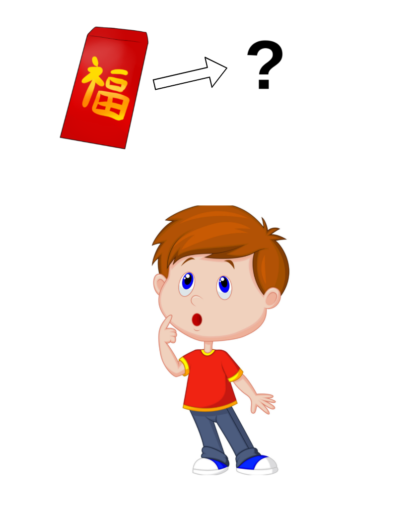

Tom is dying to know who gives him the special red envelope

Thankfully, Bayes’ theorem would be helpful in such circumstances. Consider the general example above involving two variables, X and Y. For the example above, X is the amount of money, and Y is the givers. The goal is to find yj from,

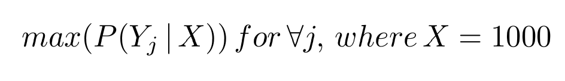

P (Y | X) is called the **conditional probability**. For instance, Tom has **observed** the red envelope that contains 1000 RMB, and p(Y | X) describes how likely is it that the giver is Y. Here X could be the condition or the observed attributes so p(Y | X) can also be interpreted as the **posterior probability** in the context of Bayes' theorem. There are two basic rules for calculating probabilities we need to know (It's easy to prove the following two rules by the definitions of probability and its characteristic, please refer to the first reference below in section 1.2 Probability if you have further interest),

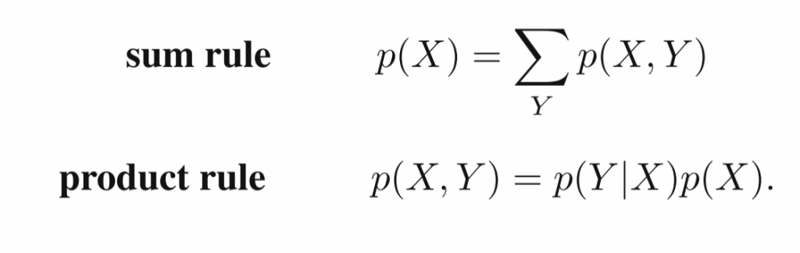

Two important rules for calculating probabilities

The probability that X will take the value _xi_ and Y will take the value _yj_ is written p(X = _xi_, Y = _yj_) is called _**joint probability**_. For example, the possibility of 1000 RMB is given by cousins could be denoted as P(x = 1000, Y = cousins). From the product rule, P(x = 1000, Y = cousins) = P(x = 1000 | Y = cousins) P(Y = cousins) . Given the symmetry property P(X, Y) = P(Y, X) and the product rule, we get,

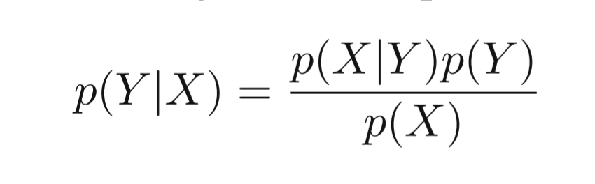

The Bayes' theorem

It's called Bayes' theorem, which plays a central role in machine learning. Using the sum rule, the denominator in Bayes' theorem can be expressed in terms of the numerator's quantities.

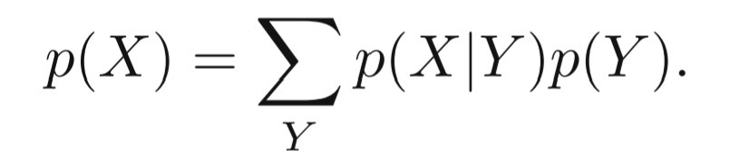

The denominator of the Bayes' theorem

Using the theorem, we could get all posterior probabilities after Tom's observing 1000 RMB in the red packet.

<table><tbody><tr><td class="has-text-align-center" data-align="center"><strong>Givers (Y)</strong></td><td class="has-text-align-center" data-align="center"><strong>P( Y | X = 1000)</strong></td></tr><tr><td class="has-text-align-center" data-align="center">Parents</td><td class="has-text-align-center" data-align="center">44.4%</td></tr><tr><td class="has-text-align-center" data-align="center">Grandparents</td><td class="has-text-align-center" data-align="center">29.6%</td></tr><tr><td class="has-text-align-center" data-align="center">Cousins</td><td class="has-text-align-center" data-align="center">7.4%</td></tr><tr><td class="has-text-align-center" data-align="center">Other relatives</td><td class="has-text-align-center" data-align="center">18.5%</td></tr></tbody></table>

The posterior probabilities

The note is most probably from Tom's parents, which said,

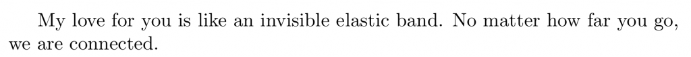

## Decision

We make numerals decisions each day that probably haven't been noticed. In the morning, when we wake up, the first choice we have to make is often about breakfast, including the type of food, noodles? Bread and milk? Cakes? The places, Restaurants? Dining halls? or from a street vendor? Next, how to get to school... Faced with so many decisions, searching for "evidence" to support the choices is nearly become our instinct. We observe by asking ourselves about favorite tastes, whether the providers have satisfactory dishes and sanitary conditions.

Like what Tom has done in the previous example, to get the P(Y | X) given the observation X = 1000, he should estimate P(X | Y) and P(Y) from **prior knowledge**, and they play a role of evidence in making decisions. However, most of the time, the real-world properties are not like scattered variables 400, 700, 1000 RMB, but continuous, like your weight, height, or shoe size. We need a new math definition to describe them, so we invite **probability density**.

If the probability of a real-valued variable x falling in the interval (x, x + δx) is given by p(x)δx for δx → 0, then p(x) is called the probability density over x. The probability that x will lie in an interval (a, b) is then given by\[1\],

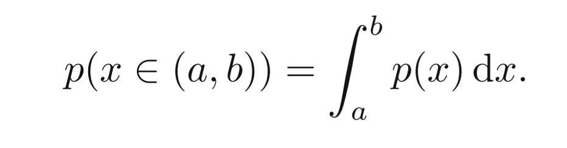

There are still problems we need to solve, what about the distribution of people's height in the world? Obviously, we can't invite everyone to measure their height, so what we have is always a part of it. That's why we need **assumptions** to make our math models both simple and reasonable, which not only suitable for our samples but make sense in other cases.

Thankfully, in probability theory, the central limit theorem (CLT) establishes that, in many situations, when independent random variables are added, their properly **normalized sum** tends toward a normal (Gaussian) distribution (informally a bell curve) even if the original variables themselves are not normally distributed\[2\].

The Gaussian Distribution

It often makes it easier for us to get the estimation of that evidence needed to calculate the posterior probability. Still, there's limitation too, and I will show you in the following experiments.

## Classify

Before we start our journey, I plan to introduce another common application by posterior probability apart from making decisions. That's the classification. The classification's goal is to take an input vector x and assign it to one of the K discrete classes Ck where k = 1, ..., K. For example, Tom has discovered that the special red packet most probably from his parents. He assigns the packet to the **label** "parents. " If he keeps doing the same for the rest of the packets, he will label all red envelopes he has received. Generally speaking, by picking out the most likely label for each case in K times, which is equivalent to make K decisions, we successfully distribute samples to classes they belong to. That's exactly how Bayes Classifier works!

## Experiments

All Python code and data for the experiments is freely available [here](https://github.com/164140757/ML/tree/main/notebooks/Bayes). You may open the JupyterLab on your PC and run it by yourself, but remember to install the libraries required, especially [Plotly with its configuration in JupyterLab](https://plotly.com/python/getting-started/#jupyterlab-support-python-35).

In the first place,  the source of data comes from our classroom. We are asked to fill in anonymous questionnaires about our height, weight, and shoe size, which can be components of the attributes vector x, and each person is labeled by gender.

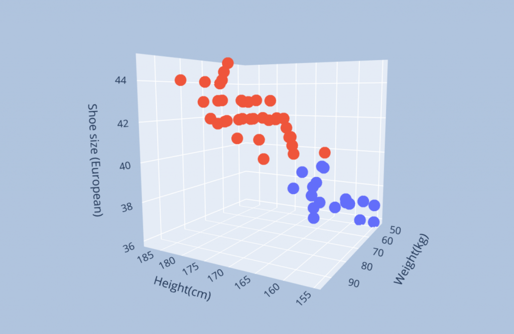

Fig 1 :The scattered plots of data where red ones are labeled "Male“， blue ones are labeled "Female"

The dimension of the input vector x happens to be three, making it suitable for 3D visualization and helpful for illustration. From the image above, in general, the distinction between the 2 classes is apparent. You could tell that the boys have a larger shoe size, heavier, and taller. It follows our intuition that a boy is normally is stronger than a girl, and there might be some positive correlations between the three factors, but in **Naïve Bayes**'s view, which assumes all attributes such as height, shoe size, and weight in this example are **independent**. In other words, every factor contributes independently to the classification.

Why we need such an assumption? That's also because the real world brings us more obstacles than we have expected. Remember little Tom's example of figuring out the special envelope? In table 1 above, a certain pattern about the possibility of givers' and the amount of money has been provided. Thus, we know the P( Money | Givers) and apply it when calculating the posterior probabilities. However, in the real world, given an attribute vector x (ubiquitous in high dimensions), P(x | class) is very difficult to estimate especially when we have limited samples. Can we tell that the average age of the "human" by the one from our class which is probably 21 years-old? With more attributes present, the problem becomes more serious\[3\].

Naïve Bayes addresses this issue by assuming that all attributes are independent. Interestingly, it gets a nice performance in lots of scenarios. One interpretation is that for a classification task, only the conditional probabilities of the categories need to be ordered correctly even without precise probability values to lead to correct classification results\[4\]. Another interpretation is that the assumption of conditional independence of attributes reduces computational overhead without negatively affecting performance if attribute dependencies affect all categories equally or if the effects of dependencies cancel each other out\[5\].

Now, let's go back to our example of classifying the scattered pots above into two classes(given height, weight, and shoe size, the Bayes Classifier predicts gender). First of all, we need to split the data "D" into two sets, in a normal case, 2/3 ~ 4/5, where the larger part is used to train the classifier. To clarify, we use Bayes' theorem to help us decide which class a sample belongs to based on each class's posterior probability. In this case, we are building a model assuming that the one with greater posterior probability is more likely to be the evaluated class. However, we need to **test** it to know whether it has a good performance or not, and we can't do it in a single set as it will lead to something like **overfitting**. Does a model with an accuracy of 100% mean it will apply to other cases outside the data we use? We need to listen to others' "opinions."

To make full use of the data available, splitting it once is squandering the resource. Here are two common approaches we adopt. First, the hold-out method will **shuffle** the samples in random order and get a cut-off line to split the set into two. It's a process of permutation mathematically speaking. The process will repeat for t times based on the size of data.

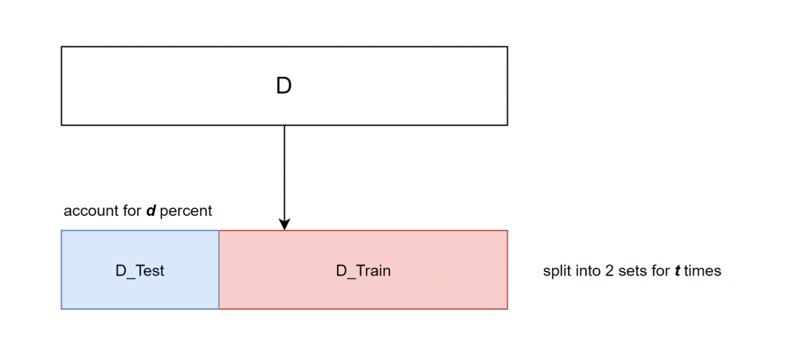

Hold-out method in splitting the data into training and testing sets

Another method is called cross-validation. Analogical to the previous one, it split data into parts but with a smaller size. For example, five-fold cross-validation will divide the set into five and evaluate each of the cases by denoting one fold as a test data set each time in sequence. One great advantage of the method is its taking full use of data by leaving out only one fold for testing while the rest for training, so the model trained in each split would be very similar to the one trained by all data.

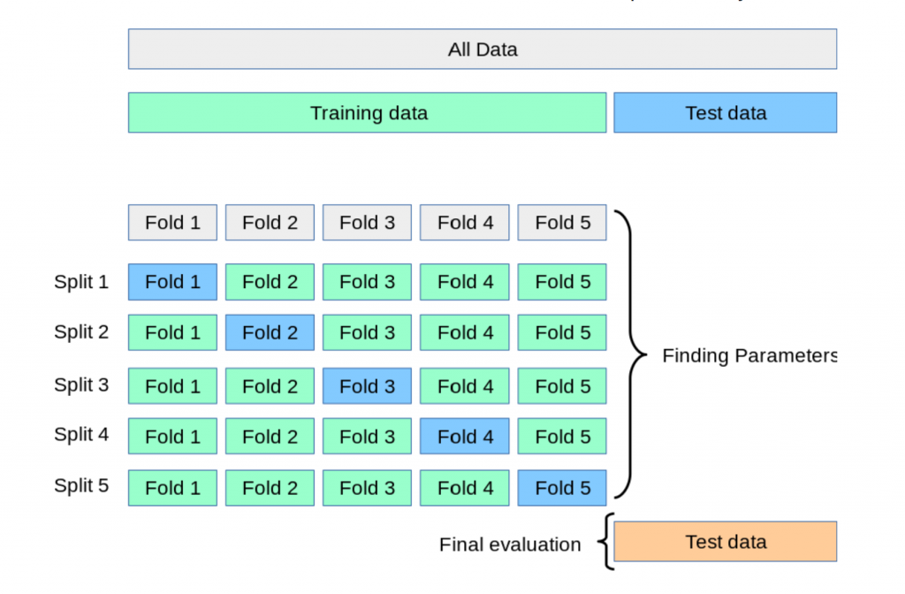

Five-fold cross validation method

Here I choose the hold-out method to train one case for illustration purposes. By selecting 75% of the data after shuffling, I project the 3D scattered plots into three-view as below.

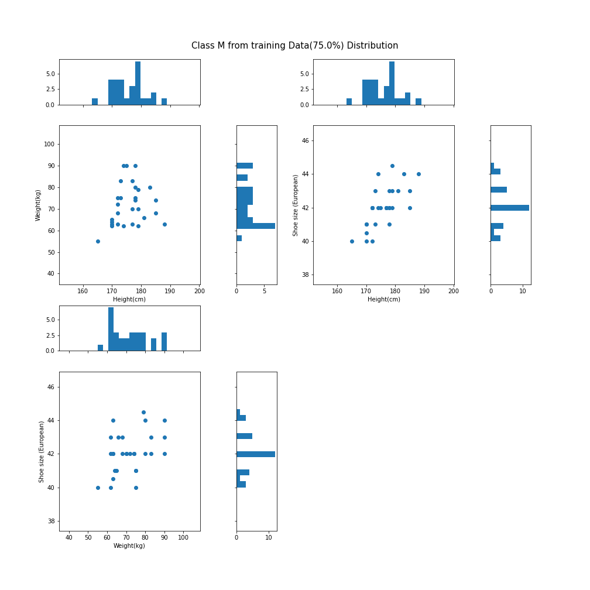

Three-view drawing based on Fig 1 and the histograms in each view denotes the distribution for each attribute

For the image above, as I explained previously, in Naïve Bayes' view, each attribute is assumed to be independent, so projecting enables us to give a closer look at each of them. One question that comes to my mind when I get this result is can the normal distribution work here? In a rough view, the bell curve can't fit into this case. Like the left-bottom picture, the histogram regarding the weight axis has a high left side. Ok, it's true. However, after I reflected on this question, I ignore the goal of training the model to **generalize** its ability to distinguish whether the attributes vector describes a male or a female. It doesn't have to fit in such a small sample!

The problem brought by  heterogeneous distribution

We have to notice that, although the small sample we use to train our model doesn't have to fit a bell curve, we assume on a larger scale, as the central limit theorem (CLT) establishes, it follows the Gaussian Distribution. If the data we provide is unevenly distributed, as illustrated above, it will dramatically change the parameters we will get. Like only plump and thin guys will make the bell curve flatten(It's easy to see this phenomenon after viewing the formula). Our model would be damaged.

That's why we have to do a survey or invite some experts to help us build the density function, although we have multiple models, like t, Bernoulli, discrete uniform distribution, etc. It's worth mentioning that another handy method to get density function is in a non-parameterized way, like Kernel density estimation (also termed the **Parzen–Rosenblatt window** method). In general, it is closely related to histograms like above but can be endowed with properties such as smoothness or continuity by using a suitable kernel. For detail, please refer to reference 6.

Comparison of the histogram (left) and kernel density estimate (right) constructed using the same data. The six individual kernels are the red dashed curves, the kernel density estimate the blue curves. The data points are the rug plot on the horizontal axis\[6\].

As explained in Tom's example, to get posterior probability P(Y | X), we need to know P(X | Y) and P(Y)\[P(Y) is usually based on prior knowledge of statistics for classes, I will ignore it here\], where X is the attributes vector, and Y is the class. So far, for one attribute xi within vector x, we already have its density function whether we assume it follows Gaussian Distribution or others, and the next step is to get P (X | Y) \[for P(X) can be calculated based on P(X|Y) and P(Y) like stated above\]. As in Naïve Bayes's view, all attributes are independent. We get,

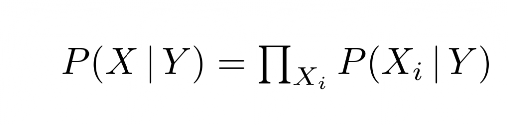

formula 1

For the illustration purpose, suppose every attribute follows Gaussian Distribution. \[Other cases with their parameters that need to be specified in their density function would be similar.\] We get,

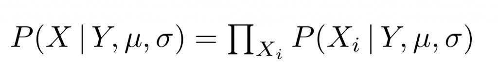

Maximum likelihood formula

where u and sigma are vectors of mean value and variance.

By Christopher M. Bishop

One of the intuitive ideas about determining the formula's parameters above is maximizing it as we try to make it **most likely** that all samples with X(attributes) appear together! The method is called **Maximum Likelihood** **Estimation**. Or more formally, let's define **conditional risk** as following\[3\],

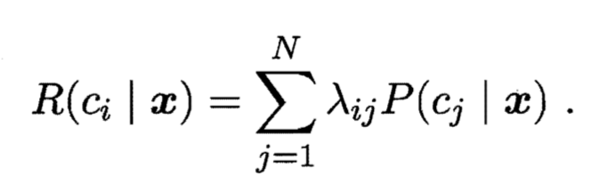

Conditional Risk

where c is the class and x is a sample with all attributes, lambda\_ij is the criterion that maps x to c, R is the conditional risk. To make the classifier robust, our goal is to find a criterion lambda to minimize R (as we want the best classifier!)that,

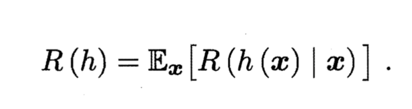

For each sample x we choose the same criteria, we get the **optimal classifier** as below,

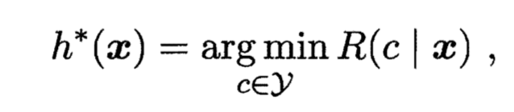

where h\*(x) is the optimal classifier.

Let's assume the criteria meets, (as you could do similarly to specify another risk value when i != j)

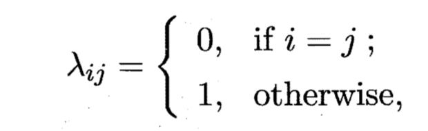

we get,

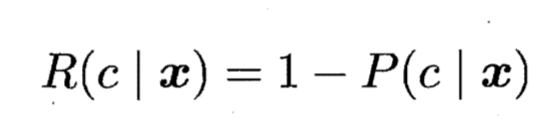

So, our goal of building the optimal classifier would be,

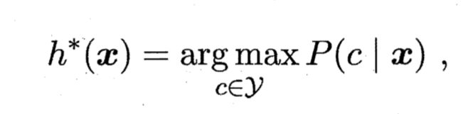

That is to **maximize** the posterior probability! It's following our intuitive feeling about making all samples appear together most likely. By the way, introducing conditional risk and the optimal classifier proves why Bayes Classifier gives a **theoretical upper limit** of model accuracy generated by machine learning. It is often used as a standard means for evaluating a new classifier's performance by comparing it with Bayes Classifier.

Let's go back again. We have density function P(X | Y) after maximizing the maximum likelihood formula above, we get,

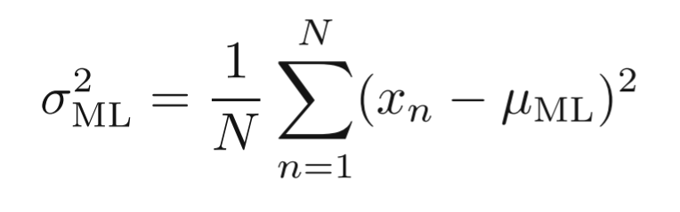

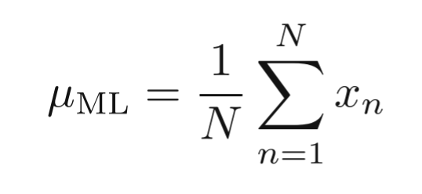

Pay special attention to the variance, as it's biased,(I don't want to explain further here, you could refer to this [answer](https://stats.stackexchange.com/questions/136673/how-to-understand-that-mle-of-variance-is-biased-in-a-gaussian-distribution/136703#136703?newreg=86f6c710ac304d47ac4a3c149cf94b3c) if you have interest).

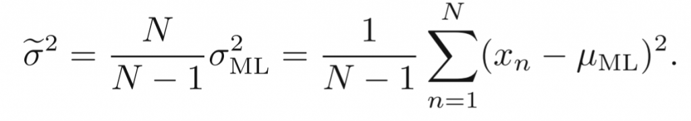

Unbiased estimation of variance

Finally, after we get P(Y), P(X | Y), under the assumption of Naïve Bayes(independent attributes), P(Y|X) can be calculated, thus our Naïve Bayes classifier is finished,

Here's a gift for my patient readers if you have followed me until now. I visualize the **decision boundary** in two ways.

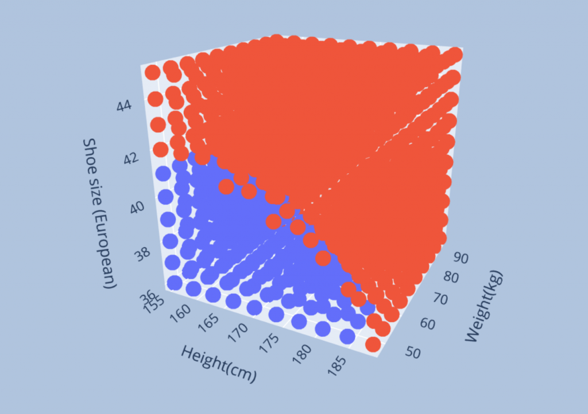

A brute-force way by inserting 1000 dots in to the cube

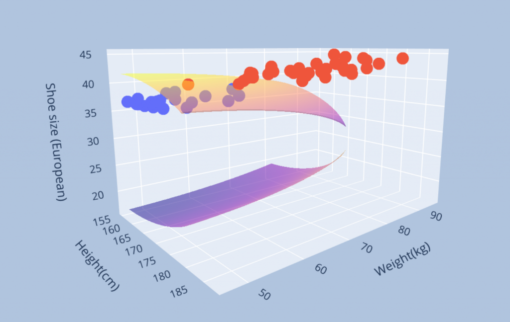

The decision boundary by solving equal posterior probabilities for two genders

I plan to investigate the **Bayes Network** in my later study, which considers the relationship between each attribute as in this experiment, their covariance matrix visualized by heatmap would be like this,

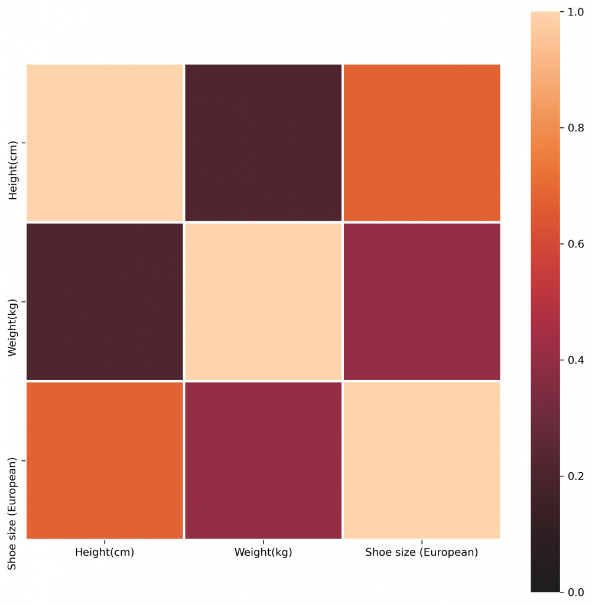

The heatmap for the covariance matrix

It tells it's possible to dig out something when considering their relationships! Would it be different from Naïve Bayes?

Thanks for your time! Since this website started, this blog might be the longest one, and there will be more! I hope you leave your comments or join my subscribers' list(scroll down to find the door!). Let listen to the earth's music together!

This work is under [Creative Commons Attribution-NonCommercial 4.0 International License](http://creativecommons.org/licenses/by-nc/4.0/). No commercial use is allowed, and please cite this passage if you want to copy, distribute, display, and perform the work, as well as make and distribute derivative works based on it. Please feel free to contact me at bht98@i.shu.edu.cn if there is any problem.

## References

1. _Christopher M. Bishop. 2006. Pattern Recognition and Machine Learning (Information Science and Statistics). Springer-Verlag, Berlin, Heidelberg._
2. Wikipedia, Central limit theorem, [website](https://en.wikipedia.org/wiki/Central_limit_theorem?oldformat=true)
3. Zhihua Zhou.2021. Machine Learning, Springer Singapore, DOI:10.1007/978-981-15-1967-3
4. Domingos, P., Pazzani, M. On the Optimality of the Simple Bayesian Classifier under Zero-One Loss. _Machine Learning_ 29**,** 103–130 (1997). https://doi.org/10.1023/A:1007413511361
5. Ng, A., & Jordan, M.I. (2001). On Discriminative vs. Generative Classifiers: A comparison of logistic regression and naive Bayes. _NIPS_.
6. Wikipedia, Kernel density estimation, [website](https://en.wikipedia.org/wiki/Kernel_density_estimation?oldformat=true)
