Hi there! Welcome to my **first** personal blog. This is a passage about [BNMatch2](https://apps.cytoscape.org/apps/bnmatch2), a biological network mapping and visualization app implemented on Cytoscape 3.8. I will begin with a simple example to illustrate the algorithm behind it and use real-world data to bring you a thorough understanding.

Hope you enjoy it.

## About me

As it's my first blog, I want to give you a brief introduction about me first. I am currently a third-year undergraduate student studying at Computer Science and Engineering School, Shanghai University in China. It's only one year to go and no more exams for me to graduate anymore 😁. So it's quite a time to do something, as my mind has absorbed knowledge and skills throughout these years. It needs an output, and here is one.

Before I went to college, I was quite obsessed with life science, especially about our human beings. That's why I nearly became a biology student when it's time to choose my major. To make a wise decision, I established a new connection with my mentor Jiang Xie since then and started my work at the laboratory. How time flies, it's already three years. I find out that in 2020, the scientific study requires more collaboration, and it makes various intriguing fields, including artificial intelligence, life science, etc. full of rush and vigor. Computer science acts like a powerful engine that accelerates all these stuff. That's the reason for my choice.

## BNMatch profile

Different biological networks have rich information to explore, including signaling pathways, conserved function modules, regulatory relationships, and the evolution of species. For example, we could use the protein-protein interaction (PPI) data in bacteria, worm, fly, and human, to determine whether the conserved sequences in different species have similar functions[\[1\]](https://pubmed.ncbi.nlm.nih.gov/27295633/#:~:text=An%20Adaptive%20Hybrid%20Algorithm%20for%20Global%20Network%20Alignment.,into%20consideration%20due%20to%20the%20underlying%20NP-hard%20problem.). It can be a means to study human disease using the model organism. An image below showcases the mechanism-of-action of the global alignment of two networks, which means to search for a counterpart sharing the topological and nodal similarity in the target graph.

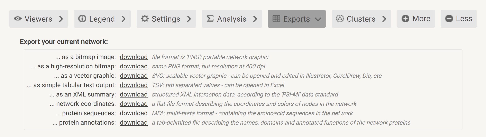

global alignment from A to B, and A' is the alignment result for A.

The two examples used below are available [here](https://github.com/164140757/BNMatch2.0), and you can download them and try BNMatch while reading the instructions.

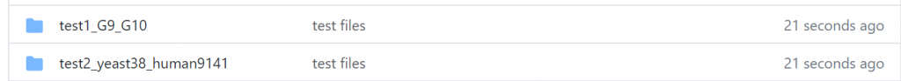

test files in GitHub

## Steps

Let's start BNMatch by clicking it from the drop-down menu.

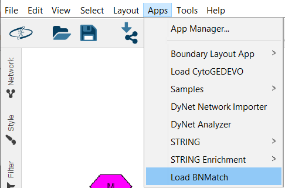

click the Apps button to load BNMatch

On the left side of your Cytoscape app, you will see a clean user interface for BNMatch.

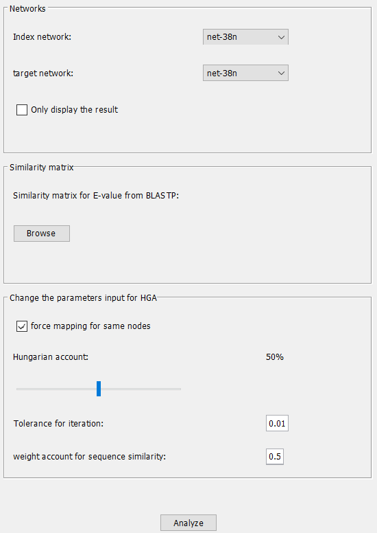

There are three sub-panels here, including the network selection, the place to choose the similarity matrix filled with the BLAST E-Value, and the parameter input area for the inner mapping algorithm.

Don't worry. Let me explain everything step by step. For a more precise explanation, I have written a simple example to show how BNMatch works.

Let's start by importing the network you want to align and the target to search.

- 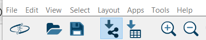
    
    from local PC
    
- 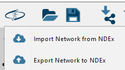
    
    from public database
    

You could load your network quickly from the toolbar embedded in the Cytoscape above, whether it's a local file or a remote one. By default, Cytoscape would carry out the force-directed layout algorithm for your networks, and BNMatch would not change your original layout, specifically the network to index. It means the result BNMatch output would have the same appearance as the index network, so it's free for you to choose how to display the result.

- 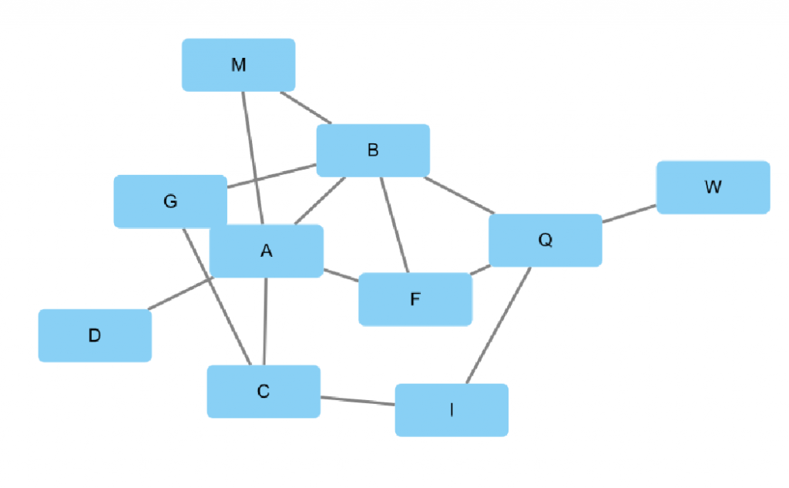
    
    network\_1
    
- 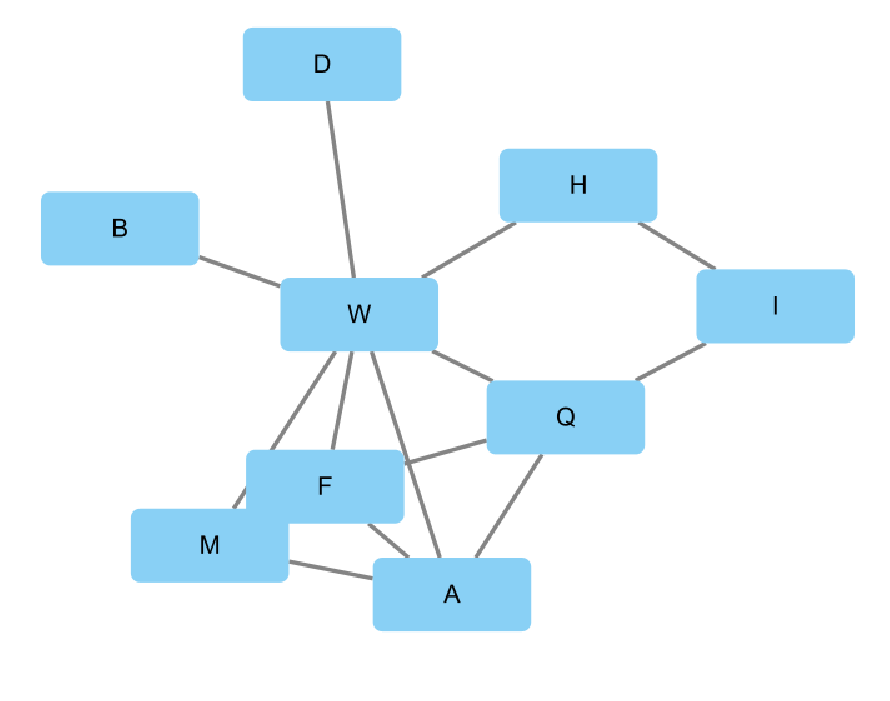
    
    network\_2
    

import tow networks by the default force-directed algorithm

There are ten nodes and fifteen edges in network\_1, nine nodes, and thirteen edges in network\_2. Generally speaking, we align a network with smaller nodes to a bigger one, and it seems a bit weird to do the reverse. In BNMatch, you could do either.

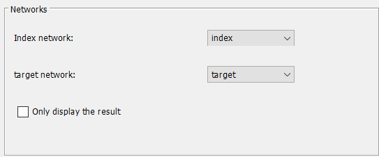

select the networks from the first panel

Another check-box here on the lower-left corner is very useful as the hybrid algorithm for mapping networks in BNMatch is time-consuming. Its time complexity is O(n\*m)^2, so for a larger scale input, if you are willing to run the mapping algorithm from a server, please check my repository on [GitHub](https://github.com/164140757/MyAlgorithms).

- 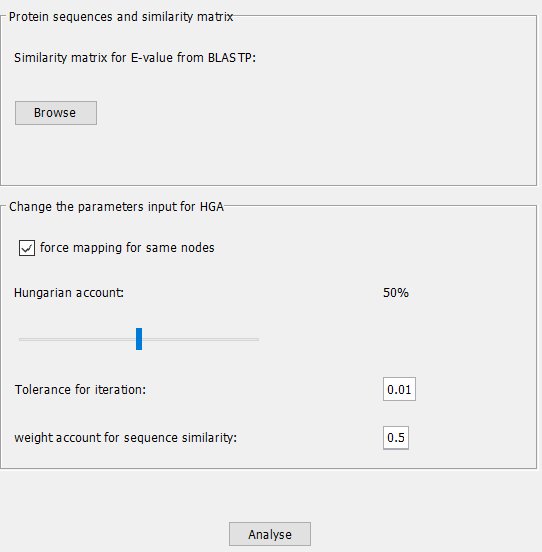
    
    analyze locally
    
- 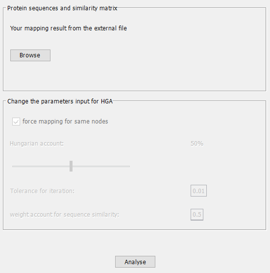
    
    just to visualize mapping
    

The panel would be different after selecting the checkbox

### To display with the external file

Let's start with the image on the right side. It will show up after clicking the check-box to display the result, and the next step is to browse your mapping file. If you run HGA in my repository, the result of the alignment would appear in 'src/test/java/resources/Jupiter/data/mapping,' and it contains all log files for every iteration, but what you need to load is just the file with the suffix "Result."

Then please click the browse button to load the mapping you would like to visualize in BNMatch.

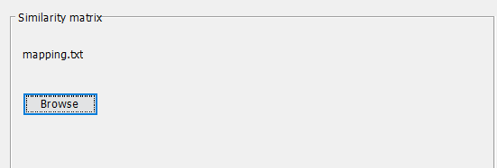

the file name would replace the tip message

You could see the result after clicking the 'analyze' button.

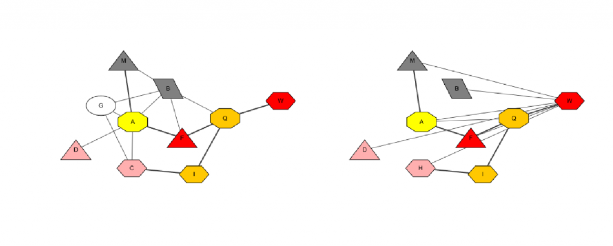

The BNMatch result

The nodes of the two networks are symmetrical, and for each alignment pair, they share the same shape and color, for instance, 'W,' the red regular hexagon node from the left side, maps to 'W' in the right side. To check all nodes pairs, you could navigate the node table below, and you can export the whole table using the buttons on the toolbar above.

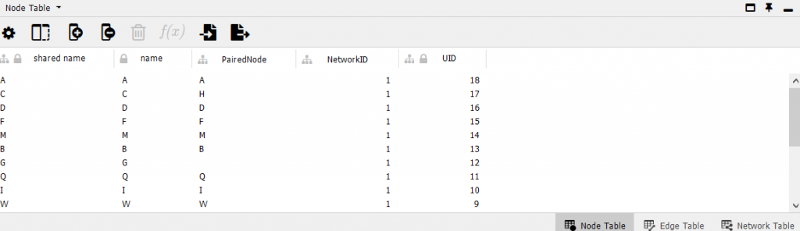

To check all pairs from the node table

It can tell from both the table and the mapping result image that 'G', the white round node is unmatched. In BNMatch, nodes miss a hit would be colored as white with round shapes.

There's another vital information hidden in 'The BNMatch result.' You guys may have already noticed that some edges turn thicker. As a typical network alignment problem, estimating the degree of topological similarity is crucial, and a common approach is to use Edge Correctness (EC), which means the percentage of edges that have been matched in the network to index.

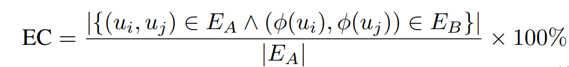

BNMatch has marked all the matched edges on the 'The BNMatch result.' Six out of thirteen has been paired, so the EC = 6/13 = 46.15%

It's convenient for you to check EC from the task history button on the lower left corner of the Cytoscape app.

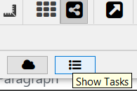

Task history button

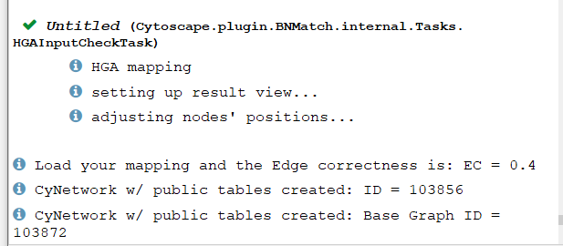

Check EC from the task history

There are other scores in the algorithm to measure the alignment, but it would not show up as there is no similarity matrix received by BNMatch, so it can't score your mapping. As you have input the similarity matrix file (I have mentioned its format and requirements below) from the server, the log files have recorded all you want to know, and just find those scores from src/test/java/resources/Jupiter/data/scoring.

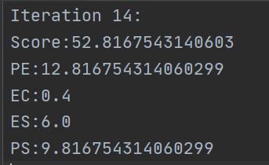

scores given by the logger

If you want to know the definitions of these measuring standards, please refer to ["An Adaptive Hybrid Algorithm for Global Network Alignment."](https://pubmed.ncbi.nlm.nih.gov/27295633/#:~:text=An%20Adaptive%20Hybrid%20Algorithm%20for%20Global%20Network%20Alignment.,into%20consideration%20due%20to%20the%20underlying%20NP-hard%20problem.) or for a brief introduction, please read the parameters section below.

Let's go back and see what will happen if the display-only check-box has not been selected.

## To run locally


Here are two panels for BNMatch to run on your local machine. Be careful. Your graphs should not be so large unless you are willing to wait for a long time, and please don't mistake it as a bug😂. To ensure you how much time would BNMatch cost, you can refer to my experiment, and it is the real-world example.

I collected a yeast subnetwork with 38 nodes, 131 edges, and human PIN\[2\] with 9141 proteins and 41,456 interactions. It took me about **two** hours in the parallel program of the mapping algorithm on CPU.

To do a great job in the matrix arithmetic. I do recommend you use a server to run the mapping and display it by BNMatch if your input is more than 5000 nodes, because even with GPU acceleration embeded in BNMatch, it's still not pleasant to watch Cytoscape with glazing eyes.And of course, there's an option to run it just in the app by GPU after setting up the driver and other environment variables properly. Please refer to my [post](http://www.haotian.life/2020/07/28/new-feature-gpu-for-hga/) if you want more information.

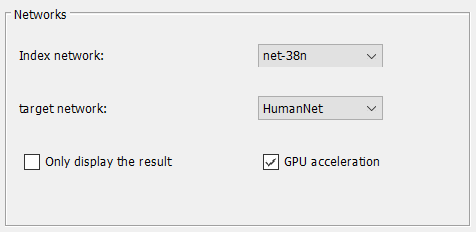

the GPU check box in BNMatch

### Similarity matrix

Let's continue to run it locally. Here you have to prepare a file called similarity matrix. Suppose there is a matrix S, and the homologous coefficient, sim(ui,vj) was calculated based on the E-Value of BLAST\[3\].

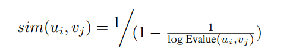

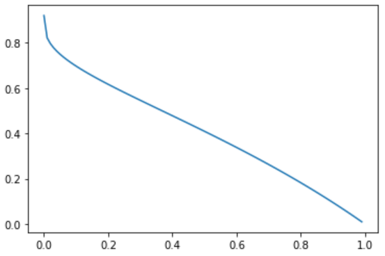

sim(x) = 1/(1-1/log(x))

Take a loke at the image above, the transformation will normalize the coefficient, and when E-Value get closer to 0 from right, and the sim(x) approaches 1. The BLAST E-value is the number of expected hits of similar quality (score) that could be found just by chance, so the lower E-value is, the more similar two sequences become.

To get the blast result, you should install [BLAST+](https://ftp.ncbi.nlm.nih.gov/blast/executables/blast+/LATEST/), a command-line local blast search tool. Prepare the gene or protein sequences files ahead and write the command below to execute blast search.

```
blastp -subject <sourceFilePath.faa> -query <queryFilePath.faa> -evalue 1e-10 -outfmt "6  qseqid sseqid evalue" -out <filePath.txt>
```

Be careful of the content of file you input, if it's protein file, use blastp and for gene sequences, use blastn instead.

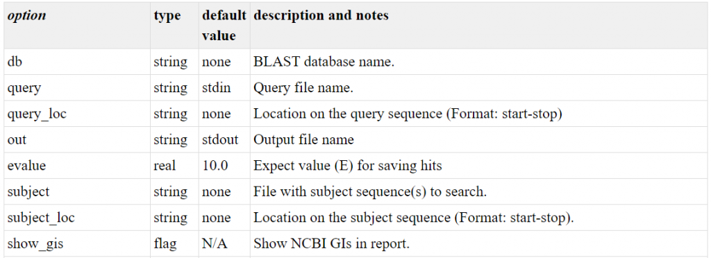

the command line references

Please refer to [BLAST appendices](https://www.ncbi.nlm.nih.gov/books/NBK279684/) for more information about the parameters in the command.

Both network files and sequence files can be download directly from [string](https://string-db.org/), and this way also ensures all nodal information is in accordance with the network.

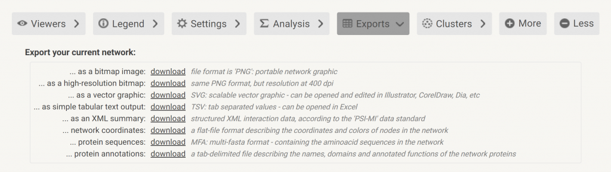

Select protein sequences MFA and simple tabular text output TSV as sources of the similarity matrix and network files.

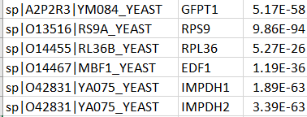

the result returned by BLAST+, and both txt and excel files which have a format like this(3 words a line) could be accepted  
The first and second columns are nodes names from index networks and target networks, and the third is for the similarity matrix between them.

Notice, the ink file is not legal, if you are in a Windows environment.

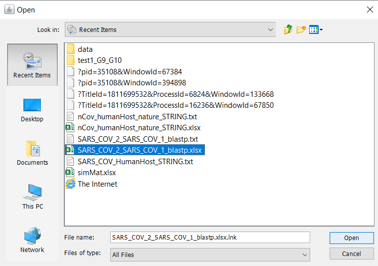

Don't choose files directly from recent items

Sometimes, the annotation part of the fasta files is not pleasant as it's kind of complicated for naming nodes. You could use powerful data science packages like Pandas in python to shrink the names like in the first column first, for instance, 'sp|O14455|RL36B\_YEAST' to 'RL36B'.

```
# the first column's names are too complicated, and shrink it to the name you prefer
data.iloc[:,0] = data.iloc[:,0].str.replace(r'_YEAST',"").str.replace(r'.*\|',"")
```

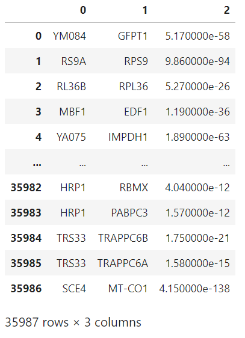

pandas shrinks the names in the first column

Be cautious that the names in this chart should be the same as those from your networks. To put it simply, consider a graph 'network\_1' I mentioned above, the node table's 'name' column should have the same information as your similarity matrix file.

- 
    
    network\_1
    
- 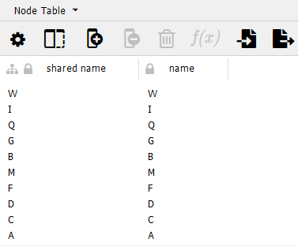
    
    the node table of network\_1
    

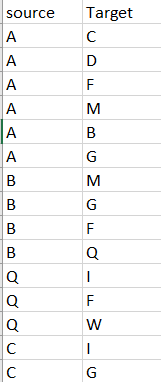

same names

Yes, it might be a little difficult here, and I hope I explain it clearly for you to understand, and if there's any question, please feel free to leave me a message.

### Parameters

If you are interested in the algorithm behind it, please refer to "[An Adaptive Hybrid Algorithm for Global Network Alignment](https://pubmed.ncbi.nlm.nih.gov/27295633/#:~:text=An%20Adaptive%20Hybrid%20Algorithm%20for%20Global%20Network%20Alignment.,into%20consideration%20due%20to%20the%20underlying%20NP-hard%20problem.)."

I will briefly explain the algorithm in this section. In a nutshell, the mapping strategy BNMatch adopts is a combination of updating, allocating, and scoring.

#### Updating

It's like training a neural network for the first part 'updating.' In my opinion, the discrepancies are that, firstly, its input is a similarity matrix (SimMat), and for any node n1 from Net1 (the index graph), and another node n2 from Net2(the target graph), the SimMat(n1,n2) represents the resemblance between n1 and n2, which consists of both nodal and topological information.

Another difference is how to train the model(here is the matrix) and in HGA(the algorithm BNMatch uses), neighbors have a significant impact on nodes. Suppose n1 from Net1 and n2 from Net2 are matched in one of the iterations, both neighbors of n1 and n2 have more opportunities to match next time and there will be a positive reward in the simMat.

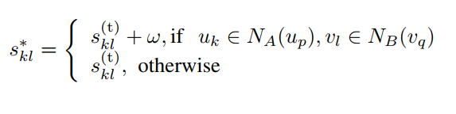

w is the positive reward, and N\_A(u) means the neighbors of u in Net A.

The approach, using 'w' for the neighbors, is based on the Neighbor Biased Mapping (NBM) \[4\] method.

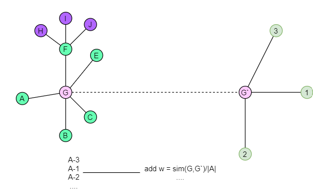

G and G' are matched, so there will be a reward for A, F, E, C, B and 1,2,3  
like (A,1), (A,2), (A,3) ... (B,2), (B,3)

For the topology part, in this updating step, it divides the topology information into neighbors and non-neighbors, which was called the topological similarity parameters (TSP).

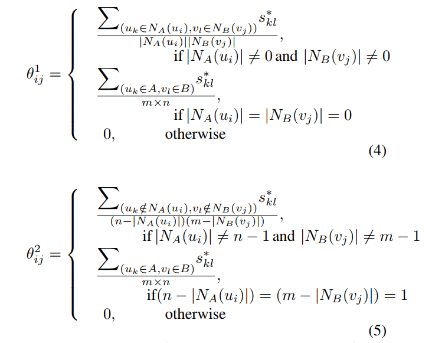

θ1 is for neighbors and θ2 is for non-neighbors

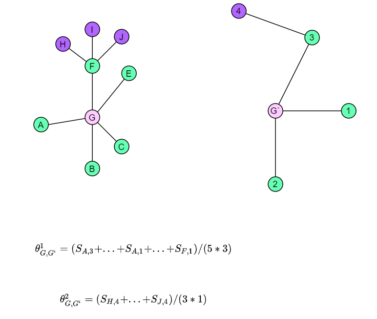

for any nodes G from Net1 and G' from Net2, θ1 is the TSP for neighbors and θ2 is for non-neighbor

The above is what HGA has done in each iteration, and the matrix will converge at some point, then it will output the best mapping result based on how HGA scores the alignment.

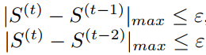

S(t) is the matrix after t times of updating. | ... | means the maximum discrepancy between the two matrixes, and  
ε is the prescribed tolerance to test whether the matrix converges

#### Mapping

The Hungarian method is a complicated algorithm to reach a global minimum or maximum with the time complicity O(n^3). In HGA, the solution it purposed is to divide the similarity matrix into two sub-matrixes, Matrix H(Hungarian) and Matrix G(Greedy). It means that apart from the Hungarian allocation, and the HGA use Greedy mapping in the Matrix G to save some time.

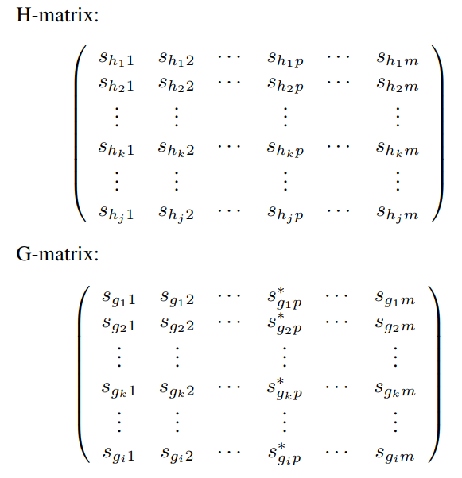

The H-matrix will adopt Hungarian allocation and the G-matrix will map greedily for each row

There's something to optimize. I found out it would be better to use the percentage to denote how much rows would put into a new matrix and run the Hungarian allocation, rather than the numbers of zeroes in a row, so I design the Hungarian Account for BNMatch. The basis for the collecting procedure, selecting 'Hungarian account' \* (total rows) which have a higher average score (the sum of row / the number of columns), rest on the notion to prioritize index-nodes with higher ratings. Then, Hungarian will handle the H-matrix first, which will achieve better accuracy than the greedy algorithm.

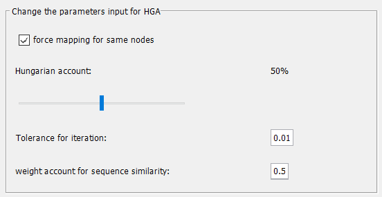

parameters panel

#### Scoring

I have mentioned EC in the previous section. For other ways to evaluate the HGA alignment, it purposes PS(point score), ES(edge score), PE(point and edge score), and SS(scores in total) to score the mapping from different perspectives.

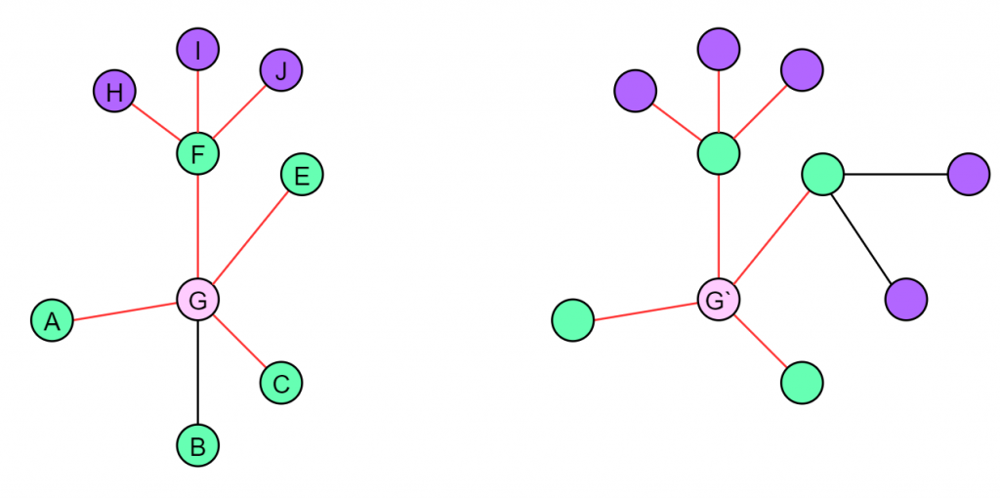

red edges are matched

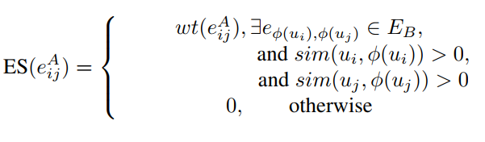

sum of scores for the red edges

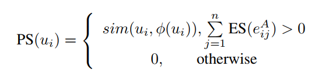

if there is an edge matched(ES > 0), there will be a point score for both the source and the target node  

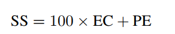

the final score will sum up EC\*100 and PE

#### Broad view


HGA will iterate until the matrix converge, or the scores haven't change for three times

There's something to notice that, if the network you want to index is quite different from the target, the loop will continue until it reach a limit, like 1000 times, and at that time, it will stop computing and give the result with the best SS(total score). It will take you a lot of time, so be careful for your inputs.

parameters are set by default.

<table><tbody><tr><td class="has-text-align-center" data-align="center">Names</td><td class="has-text-align-center" data-align="center">Meaning</td></tr><tr><td class="has-text-align-center" data-align="center">force mapping for the same nodes</td><td class="has-text-align-center" data-align="center">nodes will be forced to align if they share the same names.</td></tr><tr><td class="has-text-align-center" data-align="center">Hungarian account</td><td class="has-text-align-center" data-align="center">the portion of rows that would be put into the Hungarian matrix</td></tr><tr><td class="has-text-align-center" data-align="center">Tolerance for iteration</td><td class="has-text-align-center" data-align="center">a requirement for iteration to stop, and the matrix get stable</td></tr><tr><td class="has-text-align-center" data-align="center">weight account for sequence similarity</td><td class="has-text-align-center" data-align="center">relaxation factor to decide the portion of nodal information compared with the topological similarity</td></tr></tbody></table>

You don't have to understand in detail if you just want to get BNMatch work, and just click the 'analyze' button as BNMatch has set up these parameters already. Still, for study and research purposes, there is a must to read the essay as I can't cover every aspect of the algorithm.

Let's see the result of yeast38 vs human9141.

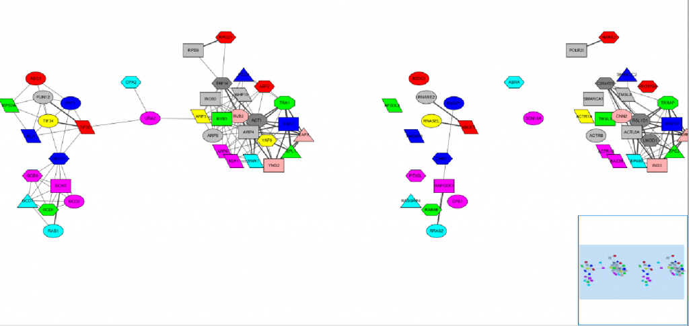

yeast38 vs human9141 by BNMatch

## Conclusion

It's a long and tuff time for me to rewrite the algorithm in Java, as seven months ago, I even don't know how to write a complete Java program, but it is rewarding. I found myself engaged in solving out problems step by step and absorb nourishment along this way and feel like I see the right path to do the research.

I will continue to update my repository in GitHub, and prepare to assemble it to a package of 'good algorithms' I learn and create in my latter life. As for HGA, I have come up with the idea that it could be used in drug repurposing as the disease module (network) has been widely used in drug discovery. It's intriguing and honorable if there is something I can do to release the burden of developing new drugs for the nCOV-19 pandemic.

Thanks for your patience to read my first blog ! 😘

## References

\[1\] Xie J, Xiang C, Ma J, et al. An Adaptive Hybrid Algorithm for Global Network Alignment. _IEEE/ACM Trans Comput Biol Bioinform_. 2016;13(3):483-493. doi:10.1109/TCBB.2015.246595

\[2\]O. Kuchaiev and N. Przulj, “Integrative network alignment reveals large regions of global network similarity in yeast and human,” Bioinformatics, vol. 27, pp. 1390–1396, 2011, doi:10.1093/bioinformatics/btr127.

\[3\] S. F. Altschul, W. Gish, W. Miller, E. W. Myers, and D. J. Lipman, “Basic local alignment search tool,” Journal of Molecular Biology, vol. 215, pp. 403–410, 1990.

\[4\] H. He and A. K.Singh, “Closure-Tree: An index structure for graph queries,” in ICDE’06: Proceedings of the 22nd International Conference on Data Engineering. Washington, DC, USA: IEEE Computer Society, 2006, p. 38, doi: http://dx.doi.org/10.1109/ICDE.2006.37

This work is under [Creative Commons Attribution-NonCommercial 4.0 International License](http://creativecommons.org/licenses/by-nc/4.0/). No commercial use is allowed, and please cite this passage if you want to copy, distribute, display, and perform the work, as well as make and distribute derivative works based on it. Please feel free to contact me by bht98@i.shu.edu.cn if there is any problem.
