Hi! Welcome to my blog. Today, we are going to talk about a new algorithm called Diffusion Kernel with its application in bioinformatics, which was first introduced by [Yan Qi et al. in 2008](https://genome.cshlp.org/content/18/12/1991). I implement it by JAVA, for I desperately need something like this to help me build the disease vicinity since genes that take part in the same pathway or process tend to be close to each other in networks\[1,2\], and that's a principal part for my research. It's free for you to navigate my code available [here](https://github.com/164140757/MyAlgorithms#dk).

## Introduction

Diffusion Kernel is a network propagation algorithm, as you first see the name, one substance that probably comes out of your mind is fluid, like water, air. Let me give you an example. Suppose it's time to have lunch now, the mouthwatering aroma of delicious food climbed towards you (the devilish temptation right?) and that's diffusion, a process that flow of matter(the smell) permeates from a region of high concentration to the lower one.

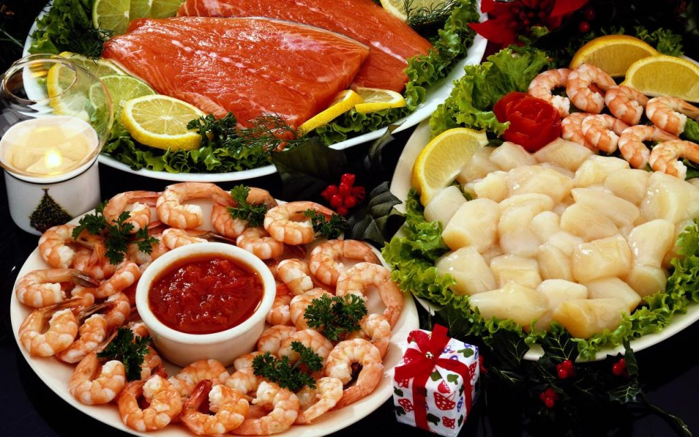

See the aroma that diffuses out of the screen!

It has played a pivotal role in graph theory. It's in [Borislav H. Hristov et al.'s work](https://arxiv.org/abs/2001.06135) where I first found this method, and here it's part of their uKIN—using Knowledge In Networks algorithm, and I would like to cite a picture in their article here.

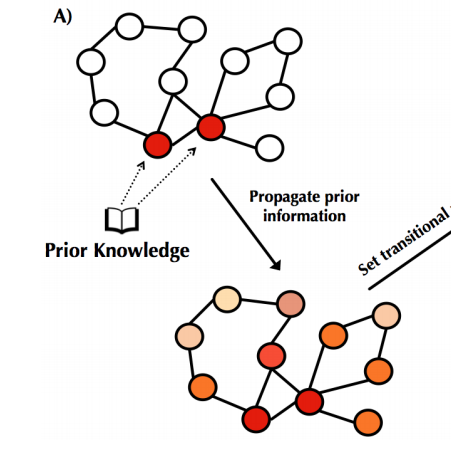

picture form [Borislav H. Hristov et al.'s work](https://arxiv.org/abs/2001.06135)

The two red nodes above, prior knowledge, is treated as the source of fluid. When the fluid pumps out from them, all connected nodes will receive part of it and are visualized as shades of red, in which deeper means the more fluid. This is how the diffusion works!

What about the kernel? Let me introduce some mathematic definations.

## Mechanism of action

A generic network (V, E) is defined by nodes V and edges E. The weights Aij of edges from node I to j define the graph adjacency matrix A where Aij = 1 if (i, j) ∈ E and 0 otherwise. Initially, there's no fluid in all nodes. Only when the source nodes are selected, the hypothetical fluid will be pumped out at a constant rate.\[3\]

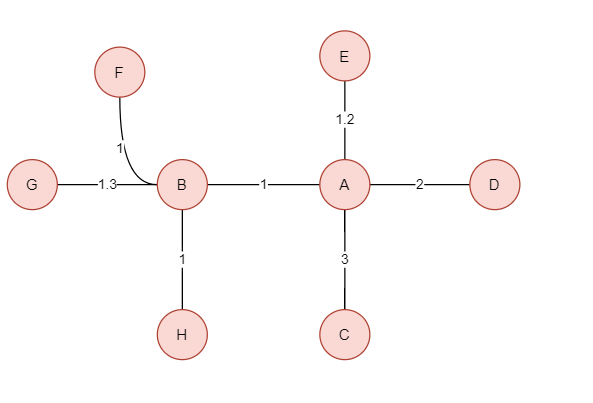

initial state

The schematic presentation above is served as a simple example for me to illustrate the algorithm and is also a test sample in my GitHub. You could try it out with your PC from [here](https://github.com/164140757/MyAlgorithms/tree/master/src/main/java/Algorithms/Graph/Dynamic/Diffusion_Kernel).

influx and outflux of nodes in the graph, and F, C are filled with fluid

Another vector b is needed here to denote which nodes are the source. bi > 0 if node i is the source node. In the graph above, bF and bC are signed.

Let's consider node A (any node from V) as a container for fluid, and the amount of fluid or its volume at time t is denoted pi(t), which is governed by flow from the source (C), A's neighbors (B, D, E), and flow out to the sink and A's neighbors (B, C, D, E, neb(D), neb(E)...if any).

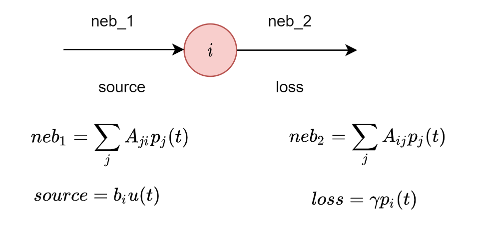

a generic node's input and output

Let's take the idea further to generalize it by math, and here're some extensions to mention, in which u(t) is a unit step function at time t, it's the amount of fluid left in the source, for only the source to add this influx. To determine the scale of the propagation, the source input is balanced by fluid loss out of each node at a constant first-order rate y.

The amount of fluid contained by node i at time t denoted as p(t),

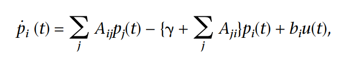

the amount of fluid for node i at time t \[3\]

Scale the single node to the whole dynamic system, represent it using linear algebra,

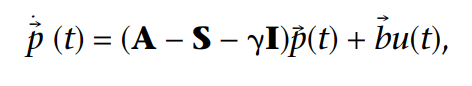

the fluid dynamic system at time t \[3\]

S matrix here is a diagonal one with Sii to record the degree of node i, as Aji denotes whether there is an influx from j to i, which equals the degree as there are no directed edges. b is a selection vector which signs the source of the fluid.

The next step is to determine when the water(fluid) in the whole system get stable, and that's the goal of Diffusion Kernel Algorithm.

Here's some graph theory knowledge probably needed for you to continue further, and if you are already familiar with these concepts, please feel free to skip this section and navigate to the 'Go Back.'

### Laplacian Matrix

In the mathematical field of graph theory, the Laplacian matrix, also called the graph Laplacian, admittance matrix, Kirchhoff matrix or discrete Laplacian, is a matrix representation of a graph. It has been used in many fields to find useful properties of the graph, including calculating the number of spanning trees, approximating the sparse cut, and constructing low dimensional embeddings, which can be useful for many deep learning applications.

Let D be the degree matrix, which is the same concept as S defined above, and A, the adjacency matrix of the graph. its Laplacian matrix L(n\*n) is defined as:

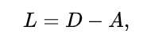

Laplacian matrix

The elements of  L are given by:

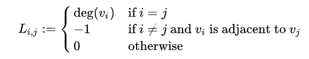

Elements in the Laplacian matrix

previous example

Take a look at the previous example above, with the vectors and Laplacian-related matrixes below, and you could better understand the definitions here. (empty entries in the matrixes below mean 0)

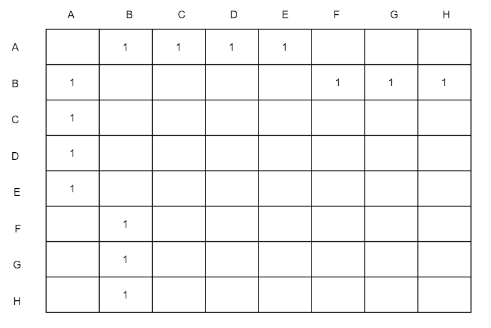

matrix A

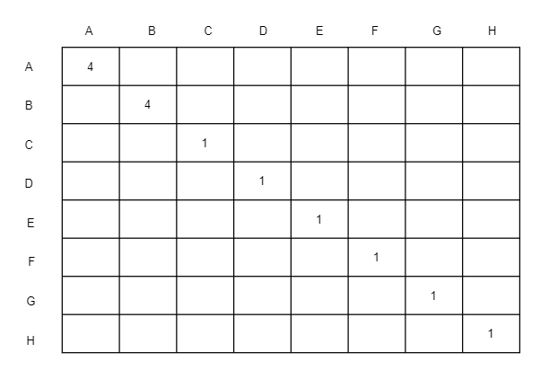

matrix D

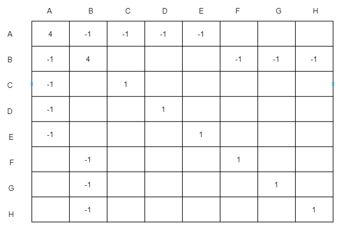

Laplacian matrix

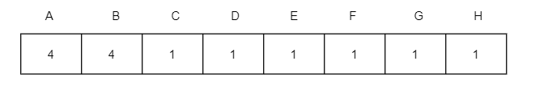

product vector

The discrete Laplace operator allows one, e.g., to generalize the Laplacian matrix to the case of graphs with an infinite number of vertices and edges, leading to a Laplacian matrix of infinite size.

Let's go back to the diffusion kernel problem.

the fluid dynamic system at time t

Letting L = - (A - S - yI) (the graph Laplacian shifted by y), the full response of the system is \[3\]

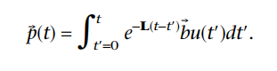

system fluid amount at time t

As t approximates infinity, the system reaches a steady-state. The equilibrium distribution of fluid density on the graph is,  

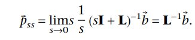

equilibrium of the system

## Methods and results

As the whole system reaches a stable state, all the scores attached to each node could be obtained from the p vector. Here comes the definition of the kernel G = L^-1, as it maps all the nodes from the initial (without scores) to a scalar similarity measure in real space R.

It resembles the water pumping out from the two source nodes 'C' and 'F', like the previous demonstration above.

Here every node is colored by the scores or scalar value denoted by vector p in the equilibrium state, and the deeper shade of the color is, the higher score it gets.

I actually plan to design an app to visualize this pipeline with the diffusion kernel algorithm underneath. Hence, it could be easily installed on every user's PC and make this algorithm more approachable. Anyway, currently, this algorithm can be fluently laughed using [JAVA-written code](https://github.com/164140757/MyAlgorithms/tree/master/src/main/java/Algorithms/Graph/Dynamic/Diffusion_Kernel) and it's free for you to use or modify for your purpose.

Hope you enjoy DK ! Thanks for you patience.

## References

\[1\] Hartwell L, Hopfield J, Leibler S, Murray A. From molecular to modular cell biology. Nature, 402:C47–52,  
1999. 
\[2\] Spirin V, Mirny LA. Protein complexes and functional modules in molecular networks. Proc Natl Acad Sci USA,100:12123–12128, 2003. 
\[3\]Qi Y, Suhail Y, Lin Yy, Boeke JD, Bader JS. Finding friends and enemies in an enemies-only network: a  
graph diffusion kernel for predicting novel genetic interactions and co-complex membership from yeast genetic interactions. Genome research, 18:1991–2004, 2008. 
\[4\][Laplacian\_matrix from Wikipedia](https://en.wikipedia.org/wiki/Laplacian_matrix)  
\[5\][Discrete Laplace operator from Wikipedia](https://en.wikipedia.org/wiki/Discrete_Laplace_operator)  
\[6\][Newman, Mark](https://en.wikipedia.org/wiki/Mark_Newman) (2010). _Networks: An Introduction_. Oxford University Press. [ISBN](https://en.wikipedia.org/wiki/ISBN_(identifier)) [978-0199206650](https://en.wikipedia.org/wiki/Special:BookSources/978-0199206650).

This work is under [Creative Commons Attribution-NonCommercial 4.0 International License](http://creativecommons.org/licenses/by-nc/4.0/). No commercial use is allowed, and please cite this passage if you want to copy, distribute, display, and perform the work, as well as make and distribute derivative works based on it. Please feel free to contact me by bht98@i.shu.edu.cn if there is any problem.
