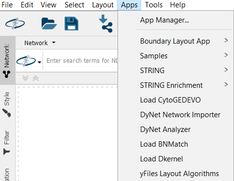
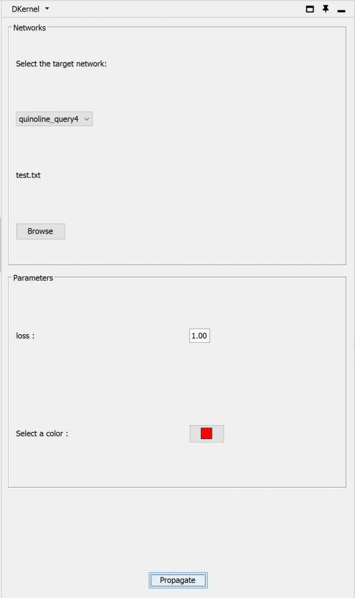
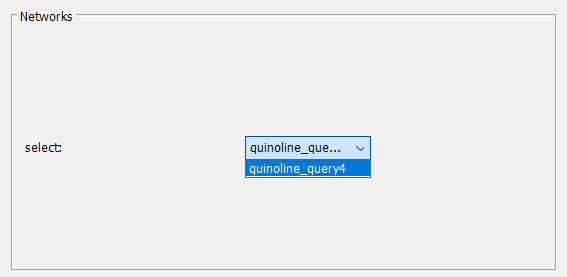
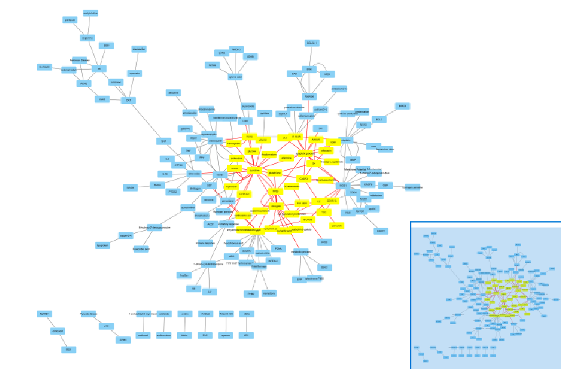
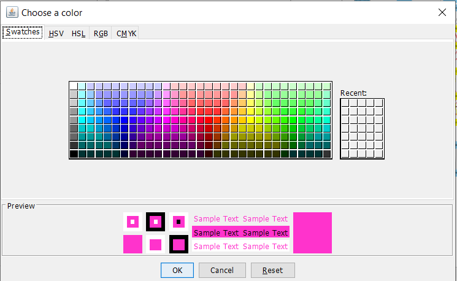
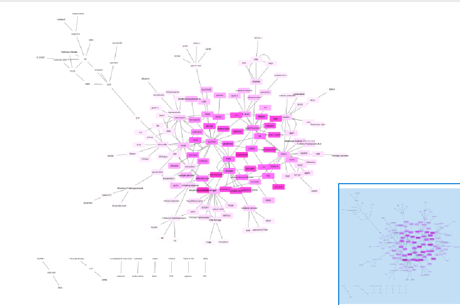
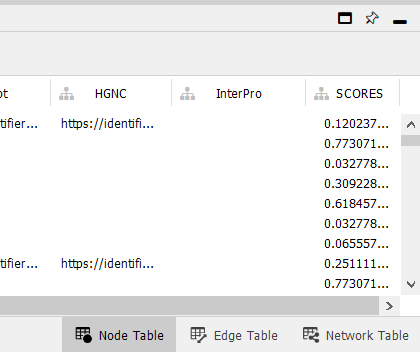
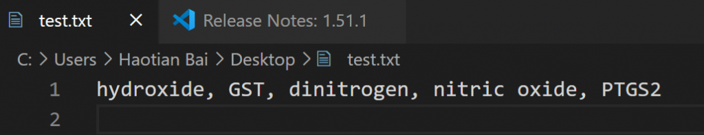

This passage is for Cytoscape app [DKernel](https://apps.cytoscape.org/apps/dkernel). DKernel stands for "Diffusion Kernel," a popular algorithm for the graph propagation based on  [Yan Qi et al. in 2008](https://genome.cshlp.org/content/18/12/1991). It aims to visualize the network propagation result by customized shades of colors and constant loss out of each node to delimit the scope.

My previous post has illustrated my understanding of the algorithm and provided some math proofs related. If you are not content to dabble, please feel free to read my [article](http://www.haotian.life/2020/08/10/diffusion-kernel/) or the original work (link above).

## Go for it

After launching Cytoscape and installing DKernel from the app store, click the "Apps" item above.

Click "Apps", then "Load DKernel"

A control panel will appear on the right side after "Load DKernel" is selected.

The UI of DKernel

There are only three choices to make, which is rather easy to use and has clear descriptions. First, in the section number one, "Networks", you should input a network, and there are various ways to load networks in Cytoscape, and please follow [the official guide](https://cytoscape.org/cytoscape-tutorials/protocols/loading-networks/index.html#/) or see [a specific example](http://www.haotian.life/2020/07/13/bnmatch-tutorial/) I wrote before for "BNMatch2", another app I developed.

Loaded networks would appear in the combo box automatically

Now, let's go on to the "Parameters" section, I have drawn a picture below to show the meaning of the parameter 'loss'.

Schematic diagram for the parameter h (loss)

In the continuous time model, the source input is balanced by fluid loss rate h out of each node in the graph. A smaller h leads to slower loss rate, and allows deep diffusion and places more emphasis on random walks that explore more of the network. \[1\] In a nutshell, If you want a larger scale, you could set the loss lower.

In the end, choose the color you prefer, select nodes in the graph as sources, and start the propagation by clicking the button below.

Select nodes from the network as sources

Choose your favorite color

The final result

Each node's color has a corresponding score based on the algorithm, and you could check or export scores in the node table below.

Scores for every node

You could select nodes by uploading a text file that contains all nodes you are preparing to propagate. The file should contain names that are separated by commas, just like the picture below.

A txt file's format for selecting nodes

Nodes will be selected

## References

\[1\] Qi Y, Suhail Y, Lin Yy, Boeke JD, Bader JS. Finding friends and enemies in an enemies-only network: a graph diffusion kernel for predicting novel genetic interactions and co-complex membership from yeast genetic interactions. Genome research, 18:1991–2004, 2008

This work is under [Creative Commons Attribution-NonCommercial 4.0 International License](http://creativecommons.org/licenses/by-nc/4.0/). No commercial use is allowed, and please cite this passage if you want to copy, distribute, display, and perform the work, as well as make and distribute derivative works based on it. Please feel free to contact me by bht98@i.shu.edu.cn if there is any problem.
