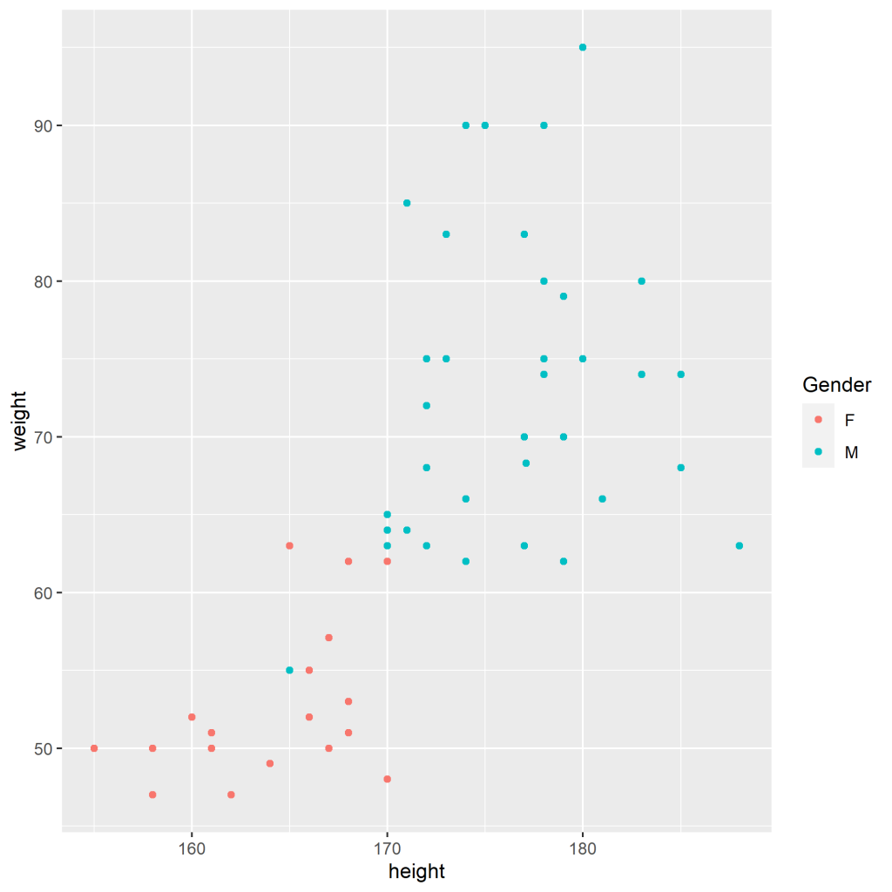
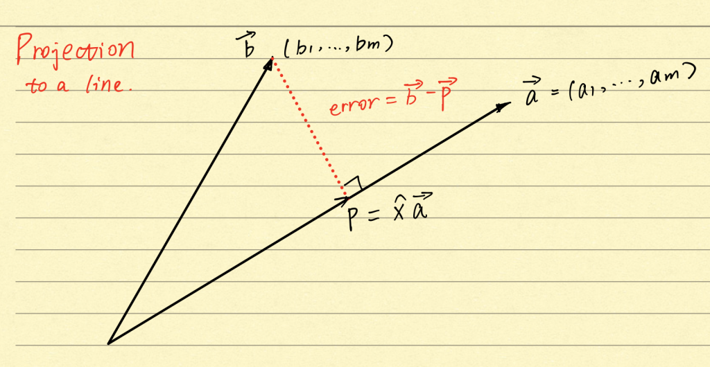
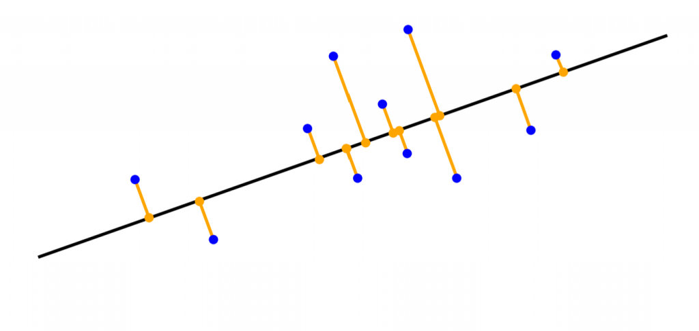

### Background

Principal Component Analysis (PCA) is proposed by Pearson(1901) and Hotelling(1933). Although more than 100 years have passed, it remains one of the frequently used algorithms in compression, features transformation, and visualization.

Let a set of observations {Xn}. Each Xn has the dimension D. We aim to project the data onto a space with dimension M < D. Take D = 2, M = 1 as an example. The data will be the same as the one used in my [last post](http://www.haotian.life/2021/01/01/bayes-classifier/) about Fisher's Classifier.

Figure 1 : observations of weights and heights

In Figure 1, every node has two attributes, including height and weight. Our goal is to find a two-dimensional vector that denotes the direction in which observations will be projected. Say, V1 is the new one-dimensional space. As we are only interested in its direction, we shall choose the unit vector that

_Formula 1_

V\_1^\\intercal V\_1 = I

Then the projected data x will be transformed into a scalar value

_Formula_ 2

V\_1^\\intercal x 

Figure 2 : A general case for projecting a vector onto a line

There's some linear algebra knowledge you should know about projection, or you may not understand how the technique is established. Given the subspace, a, in Fig 2, the projection p of any vector b will be some multiple of a, and computing this number will give the projected value "x hat." As a result, there must be some information loss in its orthogonal subspace, and we name it "error," which could be described as b - p.

Then, taking advantage of the fact that the error vector is perpendicular to the vector a, we get

_Formula 3_

\\hat{x} = \\frac{a^\\intercal b}{a^\\intercal a}

Let's replace a by V1 and b by x in formula 3, and we obtain formula 2 which is the projected data.

### Understand PCA in two perspectives

Given the descriptions above, the concept of transformation is clear. By projecting original data into a lower-dimensional space, we perform dimension reduction at the price of information loss. The next problem to solve is how to conduct this procedure with the minimum cost. One intuitive way is to evaluate the loss based on the euclidian distance between the transformed data and the original one. In general, this is a problem of optimization as the same as what we often encountered in machine learning.

#### Minimum-error

Let's introduce a complete orthonormal set of basis vectors {vi} with i = 1, ..., D that extends the idea above. The complete set provides each data in the original space access to the new coordinate system. Thus, every node could be described as a linear combination of the basis vectors. Let's add a D-dimensional location vector u here and set coefficients in dimension D-M, ..., D to 0.

_Formula 4_

f(\\lambda)  =
\\begin{bmatrix} 
u\_{1}\\\\
\\vdots\\\\
u\_{D}
\\end{bmatrix}
 + \\lambda\_1 v\_1+\\cdots+\\lambda\_w v\_w
= u + V\\lambda

where V is a D\*W matrix with W orthonormal basis vectors vi as its columns, and \\lambda is a vector with W parameters that denote the lengths in every dimension.

Our next step is to minimize the reconstruction error, which is the sum of squared differences between the new and original values. The idea here is the same as Fig 2 except that the error vector is squared.

_Formula 5_

RE = \\underset{u,\\lambda, V}{\\operatorname{argmin}}\\sum\_{n=1}^{N} \\| x\_n - u - V\\lambda\_n\\|^2

As in Formula 5, RE is a quadratic function regarding the first two parameters u and \\lambda. We could partially optimize RE regarding each of them.

_Formula 6_

\\begin{aligned}
\\frac{\\partial RE}{\\partial u} =& \\sum\_{n=1}^{N}\\frac{\\partial }{\\partial u} (x\_n-u-V\\lambda\_n)^{\\intercal} (x\_n-u-V\\lambda\_n)\\\\
=&\\sum\_{n=1}^{N} \\frac{\\partial }{\\partial u} (u^{\\intercal}u+u^{\\intercal}(V\\lambda\_n-x\_n)-(x\_n-V\\lambda\_n)u)\\\\
=& \\sum\_{n=1}^{N}2(u +(V\\lambda\_n-x\_n))
\\end{aligned}

_Formula_ 7

\\begin{aligned}
\\frac{\\partial RE}{\\partial \\lambda} =&\\frac{\\partial }{\\partial \\lambda\_n} \\sum\_{n=1}^{N} (x\_n-u-V\\lambda)^{\\intercal} (x\_n-u-V\\lambda)\\\\
=&\\frac{\\partial }{\\partial \\lambda\_n} (\\lambda\_n ^{\\intercal}V^{\\intercal}V\\lambda\_n-\\lambda\_n ^{\\intercal}V^{\\intercal}(x\_n-u)-(x\_n-u)^{\\intercal}V\\lambda\_n)\\\\
=&2(\\lambda\_n -V^{\\intercal}(x\_n-u))
\\end{aligned}

Let's set both of the derivatives to zero, then RE reaches the stationary points regarding each of the two parameters. Given the property of quadratic function, we identify that the RE has the minimum value when Formula 6 and 7 equals zero. Then, from Formula 7, we get

_Formula 8_

\\lambda\_n = V^{\\intercal}(x\_n - u)

Next, we put this value back into Formula 6, we obtain

Formula 9

(VV^{\\intercal}-I)(\\bar{x} - u) = 0

where 'bar x' is the average of x.

Formula 9 states that xn - u is in the subspace spanned by columns of V. Then, u is

_Formula 10_

u = \\bar{x}+h

where h is a D-dimensional arbitrary vector in the subspace spanned by columns of V.

From the analysis above, Formula 8 yields the optimal coordinates represented by parameter \\lambda. This means that the optimal coordinates of the projection f are given by the orthogonal projection onto the subspace spanned by columns of V.

Figure 3: optimal coordinates are from the orthogonal projection onto the subspace spanned by vi

We can visualize the conclusion in Figure 3. Given any data in the original space with dimension D, the projection with the minimum reconstruction error is P1, which is the orthogonal projection into the basis vectors. The Euclidean Distance of any P2 that is not equal to P1 will be larger than P1's.

What's more. The location vector u is arbitrary, as has been described in Formula 10. It means that the location of the new coordinate system doesn't contribute to minimizing the reconstruction error.

Let's go back to Formula 5 and continue our analysis. Substitute the confirmed parameters and delete useless location vector u. It turns out that

_Formula 11_

 RE = \\underset{ V}{\\operatorname{argmin}}\\sum\_{n=1}^{N} \\| x\_n  - VV^{\\intercal}x\_n\\|^2

where

V^{\\intercal}x\_n

It is the coordinates in which each element is a value for the corresponding dimension in W-dimensional space. Then, left multiplying V in Formula 11 shifts the values onto the new coordinate system with dimension D. That means the other D-M coordinates with respect to the basis vectors are always 0.

#### Eckart-Young Theorem in spectral norms

In formula 11, the reconstruction error is based on the norm of vector xn minus projected xn where V multiply V transpose could be interpreted as a projection matrix with the size of D\*D. To find the best basis vectors V, we need Eckart-Young Theorem here to get the best matrix approximation, and that’s the case when RE reaches a minimum value. For convenience, let's put all observations x into columns of matrix X, then Formula 11 becomes

_Formula 12_

RE = \\underset{ V}{\\operatorname{argmin}}(X-VV^{\\intercal}X)^2

The Eckart-Young Theorem states that, for any positive integer k, the best rank-k approximation of matrix is the sum top k rank-one SVD components. In formula 12, Suppose the rank of the matrix x is r. If we find the rank-r approximation of matrix X, then the problem is solved. Mathematically speaking,

_Formula 13_

\\|X-B\\| \\geq \\|X-X\_M\\|

where B is a matrix with rank M, and it is the projected matrix X. Xm is

_Formula 14_

X\_M=VV^{\\intercal}X

where u's and v's are orthonormal singular vectors and V is the basis vectors with the minimum reconstruction error. Since both XM and X are known, we could get the new basis vectors V.

#### Maximum Variance

To get insight into Formula 11, we can generally write the original data point xn as a linear combination of all basis vectors vi, it turns out that when

_Formula 15_

\\begin{aligned}
x\_n-x\_M =&( \\sum\_{j=M+1}^{D}v\_iv\_i^{\\intercal})x\_n\\\\
=&\\sum\_{j=M+1}^{D}v\_ix\_n^{\\intercal}v\_i\\\\
=&\\sum\_{j=M+1}^{D}(x\_n^{\\intercal}v\_i)v\_i

\\end{aligned}

since

VV^{\\intercal} = \\sum\_{j=1}^{D}v\_iv\_i^{\\intercal}

The reconstruction error becomes(Given Formula 15)

_Formula 16_

\\begin{aligned}
RE=&\\sum\_{n=1}^{N} \\| x\_n  - x\_M\\|^2\\\\
=& \\sum\_{n=1}^{N}\\sum\_{j=M+1}^{D}(x\_n^{\\intercal}v\_i)^2\\\\
=&\\sum\_{n=1}^{N}\\sum\_{j=M+1}^{D}v\_i^{\\intercal}x\_nx\_n^{\\intercal}v\_i\\\\
=&\\sum\_{j=M+1}^{D}v\_i^{\\intercal}XX^{\\intercal}v\_i
\\end{aligned}

Amazing things happened! You see, the X times X transpose is actually the covariance matrix for observation X.

Thus it indicates another way to solve the problem. That's to maximize the variance. Minimizing the sum squared reconstruction error is equivalent to reducing the variance of the data projected onto the subspace we ignore(from Dimension m to Dimension D). Let's interpret it from the variance's perspective.

Figure 4: The variance itself is actually the information content

From Formula 8, we already know that from the projection's point of view, the orthogonal projection is preferred regarding minimum reconstruction error. Look at Figure 4, after projection, the spread of the data is shown in the line(the new coordinate system).

For any observation x, and any basis vector vw, using the property of variance, we obtain the variance of the projected coordinate

_Formula 1_7

\\def\\Var{{{\\rm Var}\\,}}
\\def\\E{{{\\rm E}\\,}}
\\Var(v\_w^{\\intercal}x\_i) =\\E(v\_w^{\\intercal}x\_ix\_i^{\\intercal}v\_w)-\\E(v\_w^{\\intercal}x\_i) = \\E  (v\_w^{\\intercal}x\_ix\_i^{\\intercal}v\_w)

The expectation of the projected xi could be set to zero as Formula 10 tells us that the location would not help in minimizing the error.

So for data in dimension i, the variance of all observations becomes (To be clear, the Var() operation here doesn’t mean the variance of the vector, but the variance of random variables vi transpose times xi.)

_Formula 1_8

\\def \\Var{{\\rm Var}\\,}
\\def \\E{{\\rm E}\\,}
\\begin{aligned}
\\Var(v\_i^{\\intercal} X)& =\\E(v\_i^{\\intercal}x\_nx\_n^{\\intercal}v\_i) \\\\
&= \\frac{1}{N}\\sum\_{n=1}^{N}v\_i^{\\intercal}x\_nx\_n^{\\intercal}v\_i\\\\
&= \\frac{1}{N} v\_i^{\\intercal}(\\sum\_{n=1}^{N}x\_nx\_n^{\\intercal})v\_i\\\\
&= \\frac{1}{N}v\_i ^{\\intercal}XX^{\\intercal}v\_i
\\end{aligned}

To be continued ...

## The geometry of PCA

Let's draw the basis vectors in Figure 1.

## References

\[1\] Strang, G. (2019). _Linear algebra and learning from data_. Wellesley-Cambridge Press.

\[2\] Peter Deisenroth, M., Aldo Faisal, A., & Soon Ong, C. (2020). _Mathematics for Machine Learning_. Cambridge University Press.
