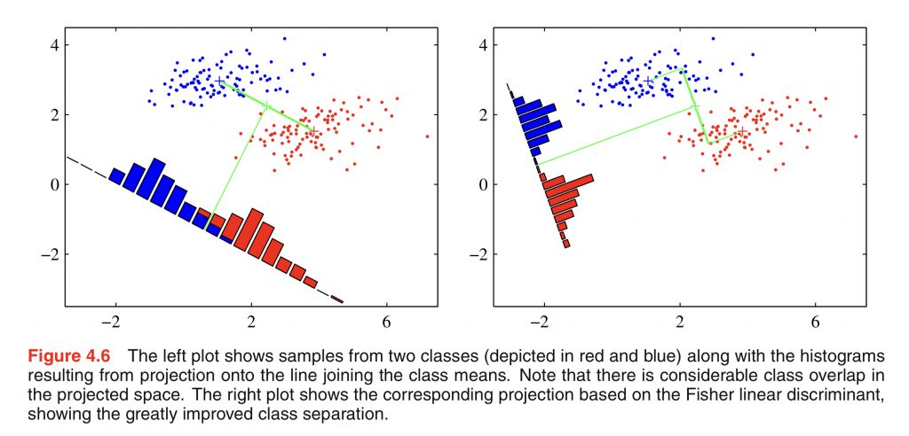
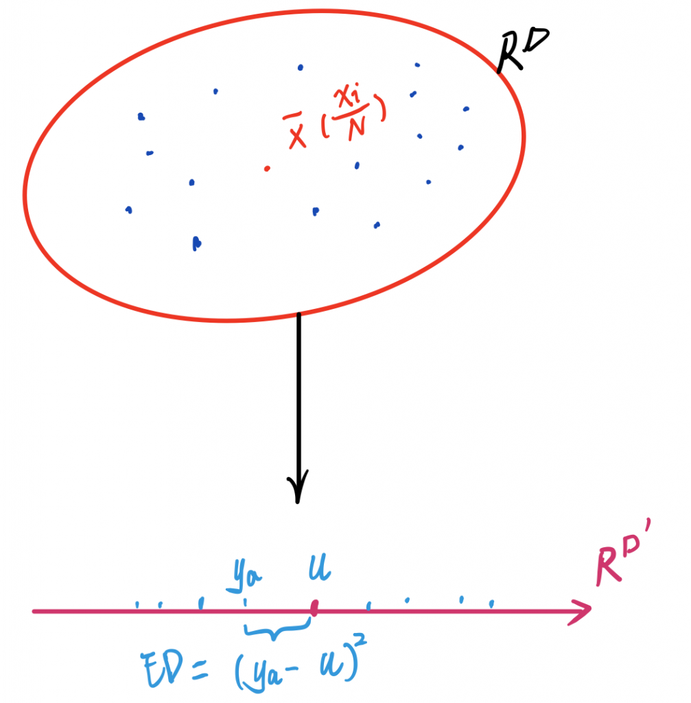
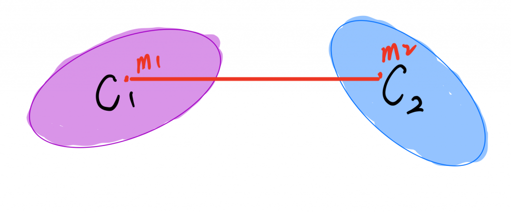
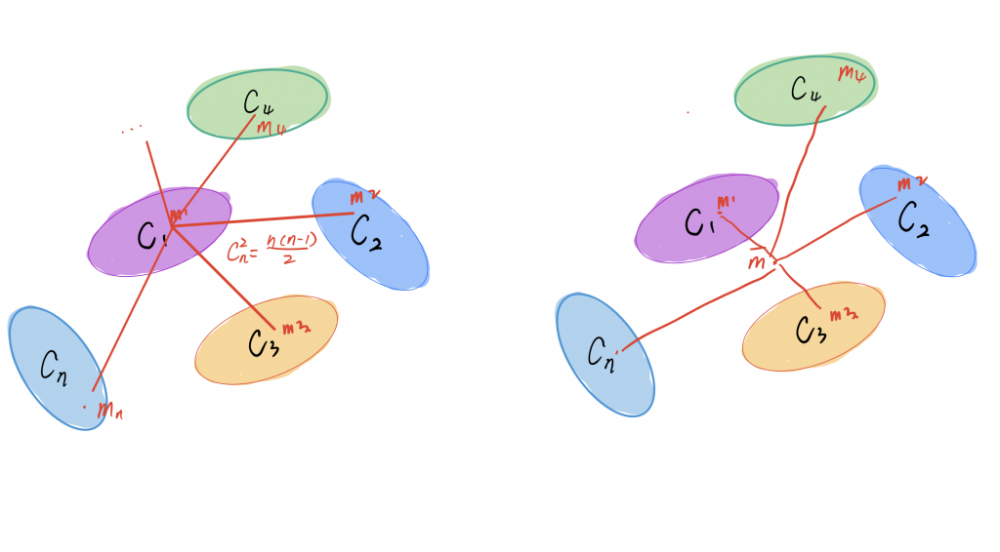
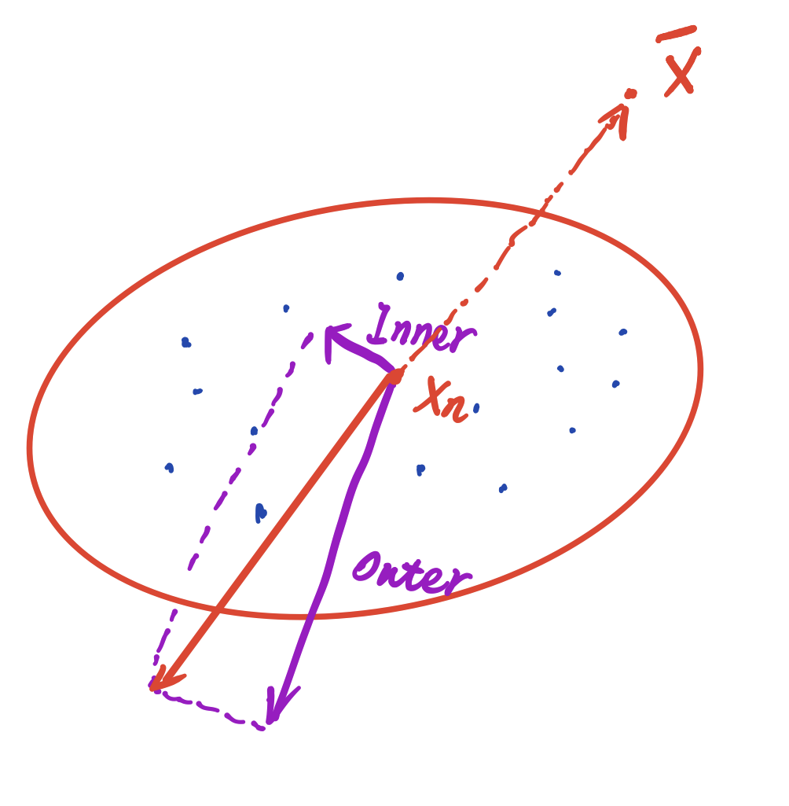
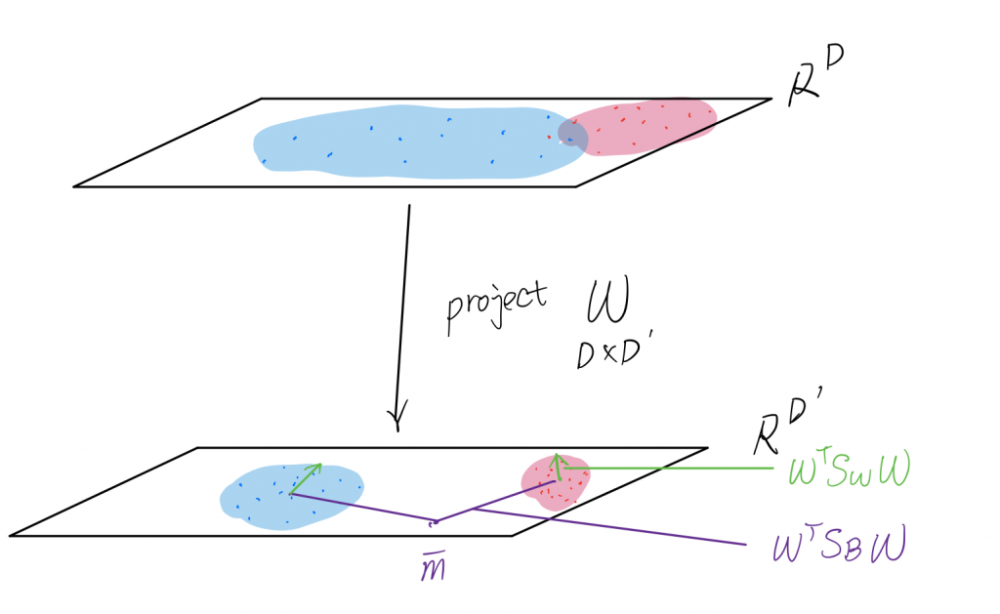

I recently engaged in the study of Machine Learning algorithms preparing for my senior thesis and would like to share what I had learned in my blogs. You guys have probably heard about 'The Feynman's Technique,' one of the world's best ways to learn anything, which usually involves these steps,

1. Choose a concept you want to learn about
2. Pretend you are teaching it to a 12-years-old student
3. Identify gaps in your explanation;  Go back to the source material to better understand it.
4. Review and simplify (optional)

Thus, writing blogs is just a way that could enable me ’understand’ things instead of knowing their names.

I have seen [a wonderful blog by Thalles Silva](https://sthalles.github.io/fisher-linear-discriminant/) about Fisher's Linear Discriminant based on _Pattern Recognition and Machine Learning_ by Christopher M. Bishop\[1\], which have already covered concepts explanation along with his experiments. Please read it or the original book before beginning this post, as I will omit things already mentioned. However, some math derivations are not explained, such as maximizing judging criteria, which involves the deduction by matrix calculus, generalization of the between-class covariance matrix, and so on. It might be difficult for some people who are not familiar with it. I identify this gap following step 3 in 'the Feynman's Technique.'

Plus, [the previous post](http://www.haotian.life/2021/01/01/bayes-classifier/) I have written is about Bayes' classifier, I will compare Fisher's performance with it using the same data of weight, height, and shoe size from my class to see the differences between the two models.

## Introduction

Graph 1: Graphic illustration of Fisher linear discriminant to improve the class separation\[1\]

For a K classes classification problem, after projecting input vector x (Dimensionality D) into y (Dimensionality D\`), where D > D’. Each of the linear feature in D’, Ya will be,

**Equation (1.1)**

y\_a = w\_a^\\top x.

where Wa is the column a of matrix W, so for a = 1, 2, ..., D’, the **projected feature vector** y could be represented by,

**Equation (1.2)**

y = W^\\top x.

To make it clear, suppose every point x below belongs to one class, which has N nodes in total in the D dimension space. The projected point in D’ space will have fewer features than D space as D > D’, which will usually give rise to overlap, such as the left in Graph1.

Graph 2: Projection in to the space with D’ dimensions

The idea of measuring how close nodes within a class is could be illustrated as the sum distances between anyone point with the mean after the projection given by a distance formula(Equation 1.2 ).\[D’ dimension euclidean space\]

**Equation (1.3)**

\\begin{aligned}
ED\_a &= (y\_a - u)^2\\\\
&= (W^\\top x\_a - \\frac {1}{N}\\sum\_{n\\in c\_k}W^\\top x\_n)^2\\\\
&= W^\\top (x\_a - \\bar {x\_k})(x\_a - \\bar {x\_k})^\\top W.
\\end{aligned}

where ED\_a is the euclidean distance between point a and the class k’s mean. Next, we get a global view of class k’s clustering by gathering all features' distances up. That is, we introduce the within-class variance Mw(Equation 1.3 ).

**Equation (1.4)**

\\begin{aligned}
M\_w &= \\sum\_{a \\in c\_k} ED\_a\\\\
&= W^\\top (\\sum \_{a \\in c\_k}(x\_a - \\bar {x\_k})(x\_a-\\bar{x\_k})^\\top)W.
\\end{aligned}

We again define the covariance matrix as Sw to simply the formula above(Equation 1.4 ),

**Equation (1.5)**

M\_w = W^\\top S\_wW.

Graph 3 : Between-class variance

The between-class variance is slightly different from the within-class. Let me explain. Suppose there are two classes, and then we measure the distance between C1 and C2(Graph 3). The between-class variance could be defined as, given the means m1, m2, where N1, N2 means the size of classes(Equation 1.2).

**Equation (1.6)**

\\begin{aligned}
M\_b&= (m\_1 - m\_2)^2\\\\
&= (\\frac{1}{N\_1}\\sum\_{n\\in c\_1}{y\_n}-\\frac{1}{N\_2}\\sum\_{n\\in c\_2}{y\_n})^2\\\\
&= W^\\top (\\bar {x\_1} - \\bar{x\_2})(\\bar {x\_1} - \\bar{x\_2})^\\top W.
\\end{aligned}

For a general K-classes classification problem, regarding how to separate each class from others, in my opinion, there are two different ways.

Graph 4: Two ways to separate classes. Left is a method that measures total distances by each of the two, which has n\*(n-1)/2 combinations. The right one works by introducing a global mean and sum all distances between it and every class mean vector.  

The first idea that occurs to me is to take every pair of classes' mean vectors into account. We need (K-1)\*K/2 edges, so it becomes a complete graph(Left in Graph 4)(Equation 1.6). Then the variance could be described as Mb.

**Equation (1.7)**

\\begin{aligned}
M\_b &=  W^\\top (\\sum\_{i,j}(\\bar{x\_i} -\\bar{x\_j})(\\bar{x\_i} -\\bar{x\_j})^\\top )W & \\forall i,j \\in c\_k \\,\\& \\, i \\neq j\\,\\& \\,(i,j) \\Leftrightarrow(j,i).

\\end{aligned} 

**Equation(1.7\*)**

S\_B = \\sum\_{i,j}(\\bar{x\_i} -\\bar{x\_j})(\\bar{x\_i} -\\bar{x\_j})^\\top

where Sb is used to describe the within-class covariance matrix. Please take a brief look at Equation 1.7; the computational cost is a bit high as its time complexity is O(D^2\*K^2), but currently, we have no idea about its performance regarding K classification. However, there's another approach to define Sb that is commonly used in Fisher's Discriminant Analysis(FDA).

What if we view every class(the ellipse) as a node and find the mean vector on a larger scale like what we have done in the within-class variance? (Right in Graph 4) Duda and Hart (1973) \[3\] defines the within-class variance by introducing the total covariance matrix St,

**Equation (1.8)**

S\_T = \\sum\_{n =1}^N(x\_n-\\bar{x})(x\_n-\\bar{x})^\\top.

where x\_ is the mean of the total data set,

**Equation (1.9)**

\\begin{aligned}
\\bar{x} &= \\frac{1}{N}\\sum\_{n=1}^{N}x\_n\\\\
N &=\\sum\_kN\_k.
\\end{aligned}

There are two factors that contribute to the total covariance matrix St, including inner and outer effort(Sb and Sw)(Graph 5),

Graph 5: Graphic illustration of the total covariance matrix which could be treated as the joint effort from the between-class and the within-class covariance matrix. (Similar to the vector decomposition)

Given Equation 1.8,1.9, and 1.4, we get that St could be dived into Sw and Sb,

\\begin{aligned}
S\_T &= \\sum\_{n=1}^{N}(x\_n - \\bar{x})(x\_n - \\bar{x})^\\top \\\\
&= \\sum\_{k=1}^{K}\\sum\_{a\\in c\_k}(x\_a -\\bar{x})(x\_a -\\bar{x})^\\top \\\\
\\end{aligned}

As we get the inner effort(within-class variance) from Equation 1.4, the outer could be found,

**Equation (1.10)**

\\begin{aligned}
S\_B&= S\_T - \\sum\_{k=1}^{K}\\sum \_{a \\in c\_k}(x\_a - \\bar {x\_k})(x\_a-\\bar{x\_k})^\\top \\\\
& = \\sum\_{k=1}^{K}(N\_k(\\bar{x\_k}\\bar{x\_k}^\\top -\\bar{x\_k}\\bar{x}^\\top -\\bar{x\_k}^\\top \\bar{x})+N\_k\\bar{x}\\bar{x}^\\top -N\_k\\bar{x\_k}\\bar{x\_k}^\\top )\\\\
& = \\sum\_{k=1}^{K}N\_k(\\bar{x\_k}\\bar{x\_k}^\\top -\\bar{x\_k}\\bar{x}^\\top -\\bar{x\_k}^\\top \\bar{x}+\\bar{x}\\bar{x}^\\top)\\\\
& = \\sum\_{k=1}^{K}N\_k(\\bar{x\_k}-\\bar{x})(\\bar{x\_k}-\\bar{x})^\\top 
\\end{aligned}

From Equation 1.10, we could tell that after extracting inner effort from the total covariance matrix, the 'outer effort' does stand on the balcony and replace each class with a class-mean vector. Then, it will be the same way as what we use to obtain the inner-class covariance matrix, despite there is a parameter Nk to do a weighted summation.

Let's review Equation 1.10 and Equation 1.7\*. It's straightforward to see that the method on the left side of Graph 4 is mean to build a complete graph while the right one tends to be a star chart. Which one is better? I think nature is keen on creating amazing beauty, especially when reaching 'equilibrium.' To see whether nature would do the same, we need some math here!

## Maximize judging criteria

Notice : Please refer to the supplements below for matrix calculus if you are not familiar with it\[4\].

The fishier criterion is aimed to maximize the between-class variance SB while minimizing the within-class variance SW with the same matrix W to project them, so we want to maximize the judging criteria (Equation 1.7, 1.7\*, 1.5)

\\begin{aligned}
J(W) =&\\frac{M\_b}{M\_w}\\\\ 
=&  \\frac{W^\\top S\_BW}{W^\\top S\_wW}
\\end{aligned}

where W (Equation 1.2) is the D\* D' matrix, Sb(Equation 1.10 or Equation 1.7\*) and Sw(Equation 1.5) are the symmetric D\*D matrixes.

Let's review the problem(Graph 6). By maximizing the

Graph 6: the overview of the problem

## Supplements

### Matrix Calculus

**Proposition S1**

Let

\\bold y =  \\Psi(\\bold x)

where y is an m-element vector, and x is an n-element vector. The symbol

\\frac{\\partial \\bold y}{\\partial \\bold x} = 
\\begin{bmatrix}
\\frac{\\partial  y\_1}{\\partial x\_1} &\\frac{\\partial  y\_1}{\\partial x\_2} & \\cdots &\\frac{\\partial  y\_1}{\\partial x\_n} \\\\
\\frac{\\partial  y\_2}{\\partial x\_1} &\\frac{\\partial  y\_2}{\\partial x\_2} & \\cdots &\\frac{\\partial  y\_2}{\\partial x\_n} \\\\
\\vdots  & \\vdots  & \\ddots & \\vdots  
\\\\
\\frac{\\partial  y\_m}{\\partial x\_1} &\\frac{\\partial  y\_m}{\\partial x\_2} & \\cdots &\\frac{\\partial  y\_m}{\\partial x\_n} 
\\end{bmatrix}

will denote the m \* n matrix of first-order partial derivatives of the transformation from x to y. Such a matrix is called the Jacobian matrix of the transformation.

**Proposition S2**

Let

y = A x 

where A is m\*n, x is n\*1, y is m\*1, and A does not depend on x. Then

\\frac{\\partial y}{\\partial x} = A

Proof: Since the **_i_**th element of y is given by

y\_i = \\sum\_{k=1}^{n}a\_{ik}x\_k

for all i =1, 2, 3, ..., m, it follows that

\\frac{\\partial y\_i}{\\partial x\_j} = a\_{ij}

Hence

\\frac{\\partial y}{\\partial x} = A

**Proposition S3**

Let

y = A x 

where A is m\*n, x is n\*1, y is m\*1, and A does not depend on x. Suppose that x is a function of the vector z, while A is independent of z. Then,

\\frac{\\partial y}{\\partial z} = A\\frac{\\partial x}{\\partial z} 

Proof: Since the _**i**_th element of y is given by

y\_i = \\sum\_{k=1}^na\_{ik}x\_k

for all i =1, 2, 3, ..., m, it follows that

\\frac{\\partial y\_i}{\\partial z\_j} = \\sum\_{k=1}^n a\_{ik}\\frac{\\partial x\_k}{\\partial z\_j}

The right hand side is simply element(i, j) of A(\\partial x/z). (Proposition S1). Hence

\\frac{\\partial y}{\\partial z} = A\\frac{\\partial x}{\\partial z} = \\frac{\\partial y}{\\partial x}\\frac{\\partial x}{\\partial z}

**Proposition S4**

Let the scalar be defined by

\\alpha = y^\\top x

where y is n\*1, x is n\*1 ,while both x and y are functions of the vector z. Then

\\frac{\\partial \\alpha }{\\partial z} = x^\\top \\frac{\\partial y }{\\partial z} + y^\\top \\frac{\\partial x }{\\partial z} 

Proof:

Differentiating with respect to the kth element of z we have(by Product Rule, please refer to section ‘other rules’)

\\frac{\\partial \\alpha }{\\partial z\_k} = \\sum\_{j=1}^n( x\_j\\frac{\\partial y\_j }{\\partial z\_k} + y\_j \\frac{\\partial x\_j}{\\partial z\_k} )

for all k =1, 2, 3, ..., m, it follows that

\\frac{\\partial \\alpha }{\\partial z} = x^\\top \\frac{\\partial y }{\\partial z} + y^\\top \\frac{\\partial x}{\\partial z}

**Proposition S5**

Let the scalar be defined by

\\alpha = y^\\top Ax

where y is m\*1, A is m\*n, x is n\*1 ,while A does not depend on x and y. Then

\\begin{aligned}
\\frac{\\partial\\alpha}{\\partial x} &= y^\\top A\\\\
\\frac{\\partial\\alpha}{\\partial y} &= x^\\top A^\\top
\\end{aligned}

Proof:

Define

w^\\top = y^\\top A

by Proposition S2

\\begin{aligned}
\\frac{\\partial\\alpha}{\\partial x} &= w^\\top = y^\\top A\\\\

\\end{aligned}

Since \\alpha is a scalar

\\alpha = \\alpha^\\top =((y^\\top)(Ax))^\\top = x^\\top A^\\top y

apply Proposition S2 again

\\frac{\\partial\\alpha}{\\partial y} = x^\\top A^\\top  

**Proposition S6**

Let the scalar be defined by

\\alpha = y^\\top  A x

where y is m\*1, A is m\*n, x is n\*1 ,and both y and x are functions of the vector z, while A does not depend on z.Then

\\frac{\\partial\\alpha}{\\partial z} = x^\\top A^\\top \\frac{\\partial y}{\\partial z} + y^\\top A\\frac{\\partial x}{\\partial z}

Proof:

Define

w^\\top = y^\\top A 

Given Proposition S4, S3, we have

\\begin{aligned}
\\frac{\\partial\\alpha}{\\partial z} &= x^\\top \\frac{\\partial w}{\\partial z} + w^\\top \\frac{\\partial x}{\\partial z}\\\\
& = x^\\top \\left(\\frac{\\partial(A ^\\top y)}{\\partial z}\\right)+y^\\top A \\frac{\\partial x}{\\partial z}\\\\
& = x^\\top A^\\top \\frac{\\partial y}{\\partial z} + y^\\top A\\frac{\\partial x}{\\partial z}
\\end{aligned}

**Proposition S7**

Let the scalar be defined by

\\alpha = x^\\top Ax

where A is n\*n, x is n\*1 ,while A does not depend on x. Then

\\frac{\\partial \\alpha}{\\partial x} = x^\\top(A^\\top+A) 

when A is symmetric,

\\frac{\\partial \\alpha}{\\partial x} = 2x^\\top A

Proof:

Apply Proposition S6

\\begin{aligned}
\\frac{\\partial \\alpha }{\\partial x}&= x^\\top A^\\top + x^\\top A\\\\
&= x^\\top \\left(A^\\top + A\\right)
\\end{aligned}

### Other rules

#### Product Rule

Let

y = f(x)g(x)

Differentiating y with respect to x, we get

\\frac{dy}{dx} = \\frac{d}{dx}(f(x)g(x))

The product of the functions can be separated by the logarithms(Proof of Chain Rule will not be present here, I plan to apply it directly).

\\begin{aligned}
\\frac{d}{dx}(log\_ey) &= \\frac{d}{dx}(log\_ef(x) + log\_eg(x))  \\\\
&= \\frac{d}{dx}(log\_ef(x)) + \\frac{d}{dx}(log\_eg(x))\\\\
&=\\frac{1}{f(x)}\\frac{df(x)}{dx}+ \\frac{1}{g(x)}\\frac{dg(x)}{dx} 
\\end{aligned}

Then expand left side, we get

\\begin{aligned}
\\frac{dy}{dx} &= y(\\frac{1}{f(x)}\\frac{df(x)}{dx}+ \\frac{1}{g(x)} \\frac{df(x)}{dx}\\\\
&=g(x) \\frac{df(x)}{dx} + f(x)\\frac{df(x)}{dx}
\\end{aligned}

## References

1. _Christopher M. Bishop. 2006. Pattern Recognition and Machine Learning (Information Science and Statistics). Springer-Verlag, Berlin, Heidelberg._
2. Thalles Silva, An illustrative introduction to Fisher's Linear Discriminant [website](https://sthalles.github.io/fisher-linear-discriminant/)
3. Richard O. Duda, Peter E. Hart, 1973, Pattern Classification and Scene Analysis, Wiley; 1st edition
4. Golub, Gene H., and Charles F. Van Loan, 1983, Matrix Computations, Johns Hopkins University Press, Baltimore, Maryland

This work is under [Creative Commons Attribution-NonCommercial 4.0 International License](http://creativecommons.org/licenses/by-nc/4.0/). No commercial use is allowed, and please cite this passage if you want to copy, distribute, display, and perform the work, as well as make and distribute derivative works based on it. Please feel free to contact me at bht98@i.shu.edu.cn if there is any problem.
