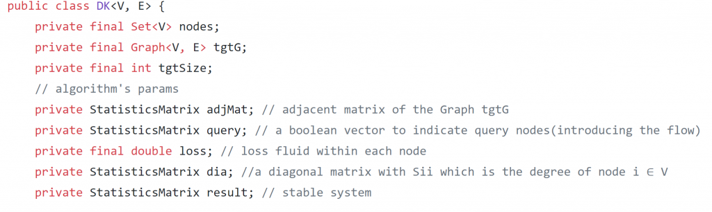
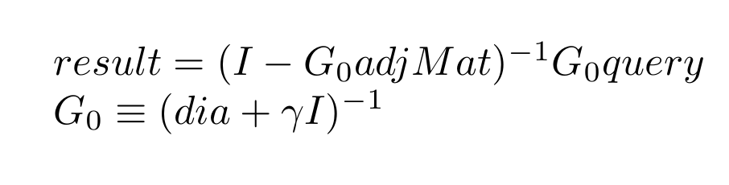
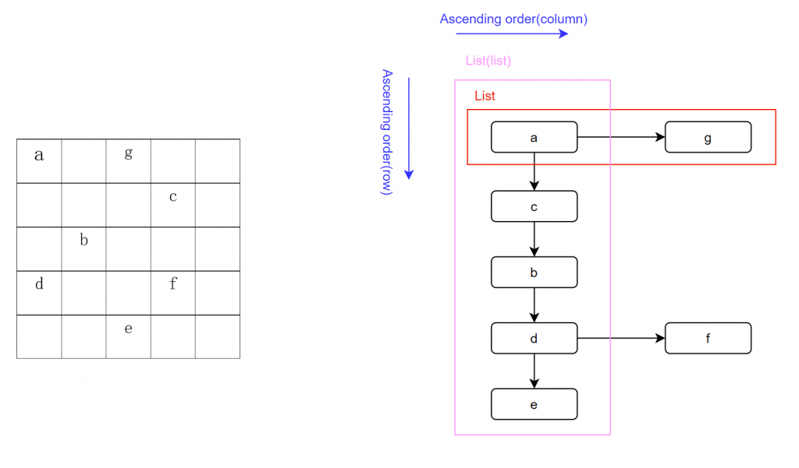
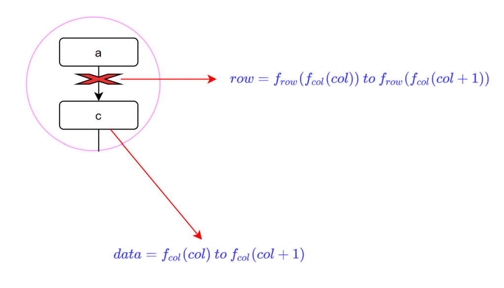
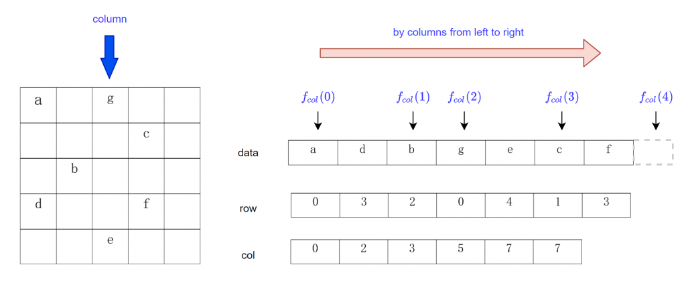
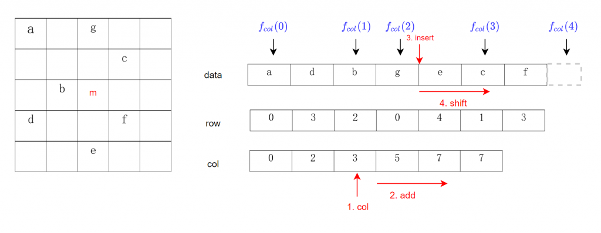

Hi! Everyone, I haven't written blogs for a period of time as I was preparing applications for graduate schools. I plan to start a category named "Study" to share what I have learned in solving the problems I encountered or something very intriguing and I hope we can learn from each other and progress together!

## Problem


Schematic illustration of diffusion

Since [DKernel](https://apps.cytoscape.org/apps/dkernel) was released, I applied it to explore the disease module, representing a connected subnetwork within the interactome rich in disease proteins. They tend to cluster in the same network neighborhood\[1-2\]. If you are interested in the diffusion process, please refer to the [post](http://www.haotian.life/2020/08/10/diffusion-kernel/) I wrote before, but it doesn't matter if you are not familiar with the context, as I will abstract the problem easy enough for everyone to understand. Unfortunately, it didn't go well as I got the following error when I ran the [test method](https://github.com/164140757/Dynamic-Network-Algorithm/blob/master/src/test/java/resources/TestModule/COV19/Drug_repurposing.java) I wrote for evaluating its performance in building the disease module in human PPI:

Exception in thread "main" java.lang.OutOfMemoryError: Java heap space

I went back to the [diffusion kernel algorithm](https://github.com/164140757/Dynamic-Network-Algorithm/tree/master/src/main/java/Algorithms/Graph/Dynamic/Diffusion_Kernel) I implemented. In this case, the high confident human PPI is a network with 11,496 vertexes, and host proteins are within the subgraph of 227 vertexes. As we know, the heap size error is always caused by application attempts to add more data into the heap space area, but there is not enough room for it. There might be plenty of physical memory available, but the java.lang.OutOfMemoryError: Java heap space error is thrown whenever the JVM reaches the heap size limit set up during the Java Virtual Machine (JVM) launch.\[3\]


Java memory is separated into two different regions. These regions are called Heap space and Permgen (for Permanent Generation)

I could probably, enlarge the initial memory allocation during set-up, but it's not a permanent solution. Thus, I went back to the data structure, as I realized that there are problems lying there.

## Space complexity

In Computer Science, there's a term called space complexity, described as the memory required by an algorithm to execute a program and produce output. Analogously to time complexity, pace complexity is often expressed asymptotically in big O notation, such as O(n), O(n log n), etc., where n is a characteristic of the input influencing space complexity\[4\].

Let's take a look at the data structure I used in [Diffusion Kernel Algorithm](https://github.com/164140757/Dynamic-Network-Algorithm/blob/master/src/main/java/Algorithms/Graph/Dynamic/Diffusion_Kernel/DK.java).



the screenshot for code at GitHub

You can refer to [the math proof](http://www.haotian.life/2020/08/10/diffusion-kernel/) if you're interested in how the diffusion happens or why the equilibrium will be like this. Now, the matrix operations would be:



The result is a vector containing an unchanged fluid amount for each node in the graph at the system's equilibrium. Go is for the convenience of calculation, as the diagonal matrix is easy to inverse.

Let's calculate how much memory it will take. Suppose there's a graph G1(V1, E1), and another G2(V2, E2), where V means the set of vertexes, E is the set of edges, V1, V2 are within the subset of V, and E1, E2 are within the subset of E.

<table><tbody><tr><td class="has-text-align-center" data-align="center"></td><td class="has-text-align-center" data-align="center">Space complexity</td><td class="has-text-align-center" data-align="center">Percentage of waste</td></tr><tr><td class="has-text-align-center" data-align="center">adjMat</td><td class="has-text-align-center" data-align="center">O(V2 * V2)</td><td class="has-text-align-center" data-align="center">1 - E2 / (V2 * V2)</td></tr><tr><td class="has-text-align-center" data-align="center">query</td><td class="has-text-align-center" data-align="center">O(V1)</td><td class="has-text-align-center" data-align="center">0</td></tr><tr><td class="has-text-align-center" data-align="center">G0</td><td class="has-text-align-center" data-align="center">O(V2 * V2)</td><td class="has-text-align-center" data-align="center">1 - 1 / V2</td></tr><tr><td class="has-text-align-center" data-align="center">dia</td><td class="has-text-align-center" data-align="center">O(V2 * V2)</td><td class="has-text-align-center" data-align="center">1 - 1/ V2</td></tr><tr><td class="has-text-align-center" data-align="center">result</td><td class="has-text-align-center" data-align="center">0(V2)</td><td class="has-text-align-center" data-align="center">0</td></tr></tbody></table>

Space complexity is expressed by big O notation, and percentage of waste explains the account of the wasted space in the matrix

It's clear from the table that lots of space are wasted as the matrixes are so special. For example, the adjacent matrix is actually a symmetric and 'Boolean' matrix. However, it has to be translated into 'double', thus I can calculate the score vector. Plus, G0 and dia are symmetric too.

To give you a more intuitive feeling about how much space is wasted. Let's look at the example I mentioned above, the host proteins subgraph with 277 nodes and the human PPI with 11, 496 nodes. It will take up to 11, 496 \* 11, 496\* (8 bytes) ~= 1 GB to build adjacent matrix, 1 GB for G0, 1 GB for dia, while 2.99 GB is of no use!

## Solution

After I realized the problem, the first idea that came to my mind is the sparse matrix. It reduces substantial memory requirements by storing only the non-zero entries. Suppose there's a matrix:


The sparse matrix example

Look at the example above. The matrix could be represented using the triple list, which is consisted of three components. 'Row' and 'Column' are used to denote the indexes of non-zero entries in the matrix. The last column stores entries' values. It's an excellent solution, but how to access each element in such a format?

Given (i, j), you could locate the element by searching the first and second columns. The time complexity is O(n), where n is the number of elements in the list. We could do better by maintaining the incremental order in the first column, get the row using Binary Search. The same for the second column. The binary search runs in logarithmic time in the worst case, making O(log n) comparisons. As more items are added, the 'matrix' becomes more 'expensive.' After a critical size, it will be more cumbersome than the original matrix, which I will prove in the following experiments.

### How to store sparse matrix

In the case of a sparse matrix, substantial memory requirement reductions can be realized by storing only the non-zero entries. Depending on the number and distribution of the non-zero entries, different data structures can be used and yield huge savings in memory when compared to the basic approach. The trade-off is that accessing the individual elements becomes more complex and additional structures are needed to be able to recover the original matrix unambiguously\[5\].

As it's not convenient for Java to get the object's size, I choose Python to experiment. You could navigate [here](https://github.com/164140757/Dynamic-Network-Algorithm/tree/master/src/main/java/DS/Matrix/Alg) to get all code or open the Jupyter notebook to run it on your PC.

#### Triple matrix

There're many implementations regarding how to build connections between (row, column) pairs to the values of the elements. It could be Dictionary of Keys(DOK) that consists of maps\[(row, column) -> value\], Coordinate list(COO) store lists of (row, column, value) triples or Lists of the list(LIL) that stores one list per row, with each entry containing the column index and the value. The mechanism is the same, and they could be named together as triple matrices.



List of the lists

Take a look at the example above. That's the design of storing non-zeros by LIL. The first layer is a list that contains all 'row lists,' and each row list consists of the row index, column indexes, and values, and the inner row list is implemented as a class below.

```
class Triple:
    def __init__(self, row):
        # safety check 
        if(row < 0):
            raise Exception('row should be positive.')
        self.row = row
        self.colList = []
        self.valList = []
```

For efficiency, all rows and columns are arranged in ascending order.

#### Compressed sparse column(CSC)



The idea of using function mapping instead of links

At an intuitive level, maintaining Triple would bring additional cost, so there's an idea of breaking 'links' up and explore connections between indexes instead. By the way, the structure I will introduce is called the compressed sparse column(CSC). CSC is likely known as the Yale format because it was proposed in the 1977 Yale Sparse Matrix Package report from the Department of Computer Science at Yale University\[6\].



CSC

For example, if we split non-zero data by columns, then for any column c, the value within column c would be at \[f(i), f(i+1)). Here, f is a function that maps column indexes to the data range. The next step is to check row indexes within the range. Thus the non-zero could be located, so the row indexes should be aligned with the data indexes. Suppose we want to access ‘g’ at (0, 2), firstly, given the column 2, we get f\_col(2) = 3, f\_col(3) = 5 which means the data is located at range \[3, 5) in the non-zero array. To specify which data to visit, next, we should check the row indexes at the same range of \[3,5) as row and data arrays share the same indexes. We find the row 0 maps to ‘g’.

The shared indexes could be sorted within each range of one specific column. Again, the binary search could provide better performance when it comes to checking which row corresponds to the data to look for.



add a new element to the sparse matrix

The algorithm for building such a structure could be illustrated by the example above. For clarity, it's free for you to look at the code [here](https://github.com/164140757/Dynamic-Network-Algorithm/tree/master/src/main/java/DS/Matrix/Alg). Like we want to insert a new value m at the third row and the third column, firstly, check the beginning index of column three by looking at f\_col(2) (starting from 0), we get 3. Then, to insert the new data at step three, the column array(f(col)) should be changed:

```
for column index(3) to end of the column length(6):
    f(col) = f(col) + 1
```

We get \[0, 2, 3, 6, 8, 8\], which means the arrows above would be shifted to right by one step after the third one.

The new element can then be put into the data array once it is located by binary search. In this case, we get 4. In the end, shift both the data and row array to leave out space at 4. We could then record the new element by data\[4\] = m and row\[4\] = 2.

## Comparison of storage ability


The result of memory cost for different types of matrix under the same percentage of vacancy

What's the most appropriate matrix type we should choose? It depends on how many non-zero values it has. There're some empirical conclusions we could tell from the graph above:

1. Compared with the dense matrix, the CSC and LIL would be pleasant when we have matrices that have non-zeros that take less than 20%.
2. LIL's cost for building the triples can be accepted when the scale of matrices becomes larger, as the LIL and CSC increasingly join together.

I will explore the efficiency of matrix operations later in my free time, as I'm curious about what new ideas CSC would keep bringing to me. Getting inspiration from the knowledge we already have could be like, Steve Jobs. said, "connecting dots in life." I don't know its benefit right now. It may shine brightly in the future. Hold this belief, I will keep writing blogs to share with you guys!

Thank you for your time!

## References

1. Menche, J. et al. Uncovering disease-disease relationships through the incomplete interactome. Science 347, 1257601 (2015)
2.  Goh, K. et al. The human disease network. Proc. Natl Acad. Sci. USA 104, 8685 (2007).
3. plumbr, Java heap space, Java garbage collection handbook, [website](https://plumbr.io/outofmemoryerror/java-heap-space#:~:text=In%20some%20cases%2C%20the%20amount,applications%20running%20on%20that%20JVM.&text=For%20example%2C%20if%20your%20application,OutOfMemoryError%3A%20Java%20heap%20space%20error.)
4. Wikipedia, space complexity, [website](https://en.wikipedia.org/wiki/Space_complexity?oldformat=true)
5. Wikipedia, sparse matrix, [website](https://en.wikipedia.org/wiki/Sparse_matrix?oldformat=true)
6. Eisenstat, S. C.; Gursky, M. C.; Schultz, M. H.; Sherman, A. H. (April 1977). ["Yale Sparse Matrix Package"](https://apps.dtic.mil/dtic/tr/fulltext/u2/a047724.pdf) (PDF). Retrieved 6 April 2019.

This work is under [Creative Commons Attribution-NonCommercial 4.0 International License](http://creativecommons.org/licenses/by-nc/4.0/). No commercial use is allowed, and please cite this passage if you want to copy, distribute, display, and perform the work, as well as make and distribute derivative works based on it. Please feel free to contact me by bht98@i.shu.edu.cn if there is any problem.
