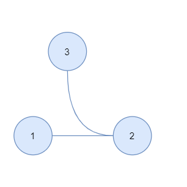
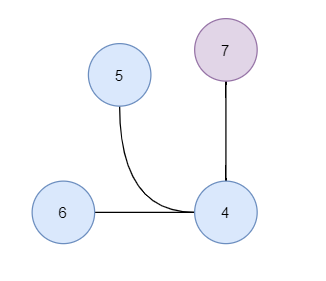
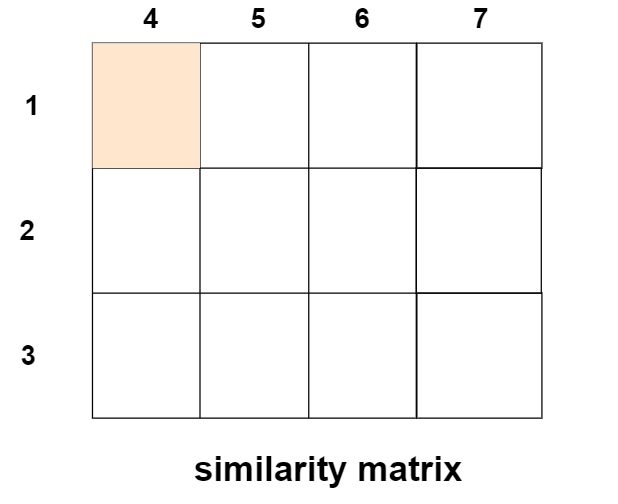

NVIDIA-Titan-X-GPU

Accessing GPU has unleashed more possibilities for scientific study in new areas, the innovation of products, and bringing higher efficiency in tackling the problems that seem tricky. Today, I will lead you a wonderful tour for the GPU computing in the hybrid Hungarian and Greedy algorithm (HGA) implemented by java. If you're not familiar with the algorithm, don't worry, I will only scratch the surface of it and mainly focus on sharing my approach to using [Aparapi](http://aparapi.com/) as a convenient way to employ GPU in java. For more information, you could navigate to my first [blog](http://www.haotian.life/2020/07/13/bnmatch-tutorial/) for an app called BNMatch in Cytoscape store, the parameters section where I describe it with some simple examples.

GPU may sound like a distant word from java programming. I have no idea how to make the effective use of GPU by JAVA until I find a [blog](https://blogs.oracle.com/javamagazine/programming-the-gpu-in-java) posted on January 10, 2020, written by Dmitry Aleksandrov, one of the Oracle Groundbreakers. He explains everything for a java developer to know about GPU programming, the GPU architecture, the differences compared with CPU, and provides various resources and convenient ways to access GPU with JAVA.

## Aparapi


Aparapi, an Open-source framework for executing native Java code on GPU

In my perspective, Aparapi, which allows developers to write native Java code capable of being executed directly on a graphics card GPU, is the most convenient approach. For example, add two vectors.

```
final float inA[] = .... // get a float array of data from somewhere
final float inB[] = .... // get a float array of data from somewhere
assert (inA.length == inB.length);
final float result = new float[inA.length];

for (int i = 0; i < array.length; i++) {
    result[i] = inA[i] + inB[i];
}
```

which can be rewrote as the followings to refactor the sequential loop.

```
Kernel kernel = new Kernel() {
    @Override
    public void run() {
        int i = getGlobalId();
        result[i] = inA[i] + inB[i];
    }
};

Range range = Range.create(result.length);
kernel.execute(range);
```

The kernel here denotes the computing unit of the device(GPU), and every unit on the GPU will execute the run() method synchronously. It's super clean, obvious, and approachable for a beginner.

## problem to be solved

Here, I want to give you an overview of my problem, which desperately needs GPU's help in HGA, and like what GPU always benefits us in programming, to improve efficiency.



network to index, g1



network to search against, g2



Suppose there're two networks, HGA's job is to find the equivalent part from the network to search against.

To map globally, HGA should take both nodal and structural information into consideration.

And all of these have been compacted in a matrix called the similarity matrix, like (1,4) denotes how much node1 from g1 resemble node4 from g2. In HGA, each item in the matrix will update by node pairs, such as neighbor pairs for (1,7): { (2,4) }, non-neighbor {(3,5),(3,6)}, so for a matrix with the width n, and the length m, the time complicity will be (n\*m)^2.

But we have to notice that calculating an item in the matrix, like (i, j), will not be interfered by (i\`, j\`), because in HGA, it will use the matrix from the previous state, and it has nothing to do with the current one. This feature, every component is independent, makes it a well-suited candidate for GPU programming.

## Method and result

In this section, I will show you my design using Aparapi to improve the efficiency in HGA. It turns out that for 38\*9141, it took 2 hours for multithread programming on CPU while only 7 minutes on GPU, so the speed-up ratio is about 17 times!

As the [kernel guideline](http://aparapi.com/documentation/kernel-guidelines.html) in Aparapi's document, when you tend to use Aparapi to develop your application, here are some tips for you:

- Java objects, like Vector, ArrayList, HashSet, are not allowed, as references to or through a Java Object other than the kernel instance will cause Aparapi to fail to create OpenCL.

```
@Override
public void run() {
    // creating JAVA objects are not allowed here
    // HashSet<Integer> set = new HashSet<>();
}
```

- Only one-dimensional arrays are supported.

```
@Override
public void run() {
    // only one dimension array here
    int[] array = new int[length];
}
```

- get() should be called to draw back data loaded on GPU

```
 kernel.execute(range).get(out);
```

These are tips I find extremely important to start your work using Aparapi. To see the kernel's full code, please visit [here](https://github.com/164140757/Dynamic-Network-Algorithm/blob/master/src/main/java/Algorithms/Graph/Alignment/HGA/GPUKernelForHGA.java); and there're some examples written by Aparapi, and they could be found on this [website](https://git.qoto.org/aparapi/aparapi-examples/-/tree/master/examples/movie/src/com/amd/aparapi/examples/movie). You could also run one of my test methods to practice by yourself, following the instructions [here](https://github.com/164140757/Dynamic-Network-Algorithm/tree/master/src/main/java/Algorithms/Graph/Alignment/HGA).

I do recommend you run GPU programs on Linux, although Windows is an excellent platform to run, however, it's a pity that building up your application on it is quite tedious.

Go ahead and wake your GPU up!

[](http://creativecommons.org/licenses/by-nc/4.0/)

This work is under [Creative Commons Attribution-NonCommercial 4.0 International License](http://creativecommons.org/licenses/by-nc/4.0/). No commercial use is allowed, and please cite this passage if you want to copy, distribute, display, and perform the work, as well as make and distribute derivative works based on it. Please feel free to contact me by bht98@i.shu.edu.cn if there is any problem.
