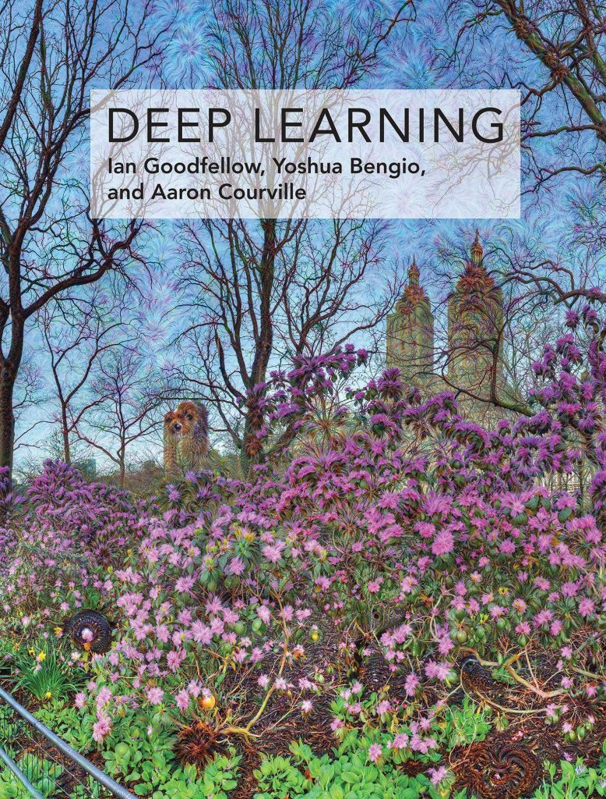
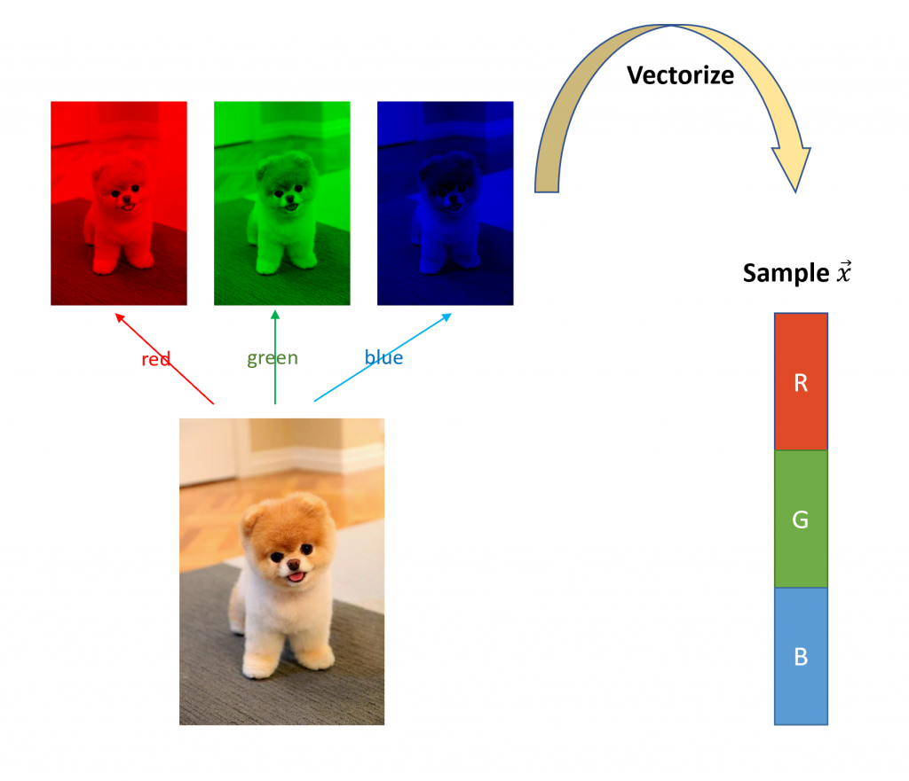

Hi! Welcome to one of the hottest topics about the state-of-the-art technique, deep learning. As this is a new series of sharing, I would like to present a rough architecture to draw an overview of what you are going to read. In series 1, we will begin with an exploration of the neural network, which forms the backbone of deep learning. The first series play a role as reference pages, and it will cover topics like the definition of the neural network, propagation, activation functions, etc. You are very welcomed to go back here at any time to review the very basics of deep learning as I would maintain it throughout my study. Next, I will include the latest breakthroughs in artificial intelligence, such as transformers in series 2 and most of them came from the top journals. The purpose of writing blogs like this is to present you with a systematic view of the latest advances and how they are built. Don’t be afraid of matrix calculus, linear algebra as I would explain it with solid derivations. If you find it hard for you to continue, you are welcomed to turn to the materials below from which I taught myself.

Material notes:I highly recommend the two listed below.

- 
    
    Deep Learning Specialization
    
- 
    
    Deep Learning
    

The recommended resources for further studying

1. Deep Learning Specialization, by Prof. Andrew Ng at Stanford. It’s one of the best online courses for beginners, no matter you are a practitioner or a researcher.
2. Deep Learning by Ian Goodfellow et all. The book is written by three experts in this field and even Elon Musk commented it as “the only comprehensive book on the subject.” It involves a wide range of studies regarding deep learning and it complements the online course above.

Deep learning is currently thriving in many practical applications and heated research topics, such as computer vision, natural language processing, autonomous driving, etc. Compared to traditional machine learning, it draws knowledge from experience and provides a hierarchy termed "neural network" to learn the pattern by itself. The pattern, however,

To understand what's the neural network and how it functions in deep learning, let's begin with an example, a binary classification problem in image recognition.

## An example: binary classification

Fig 1: A vectorized image as a sample to input

Comparing with the traditional computer vision approach like feature engineering, deep learning has adopted another way, by composing layers of functions to learn the mapping

\\bold y = f(\\bold x;\\bold \\theta)

from input vector x to the target vector y with the parameter vector that best approximates categories y.

However, feature engineering needs to define image features such as sharpening, edge relationships, volumes, and etc. before proceeding with classification. On the contrary, deep learning starts training immediately since what it needs is just images themselves, the pixels, the gray values, or the density.

Think about the binary classification problem shown in Fig 1 above. How could we teach machines to check if it's a dog or not? Classic machine learning requires prior knowledge from human beings to define what characterizes a dog. For example,

## Notations

## Neural Network

## Loss and cost function

## Activation function

## Propagation

## References
