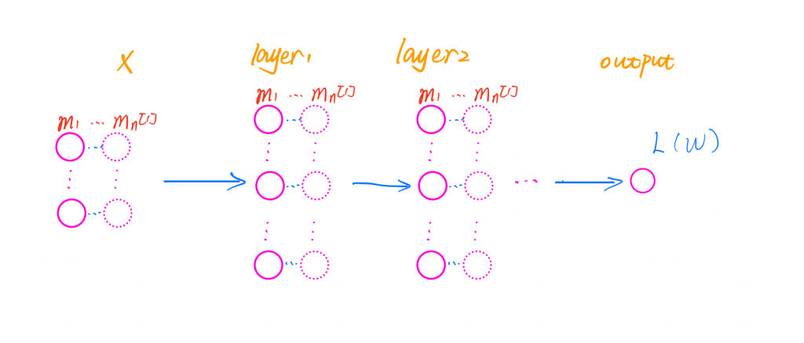
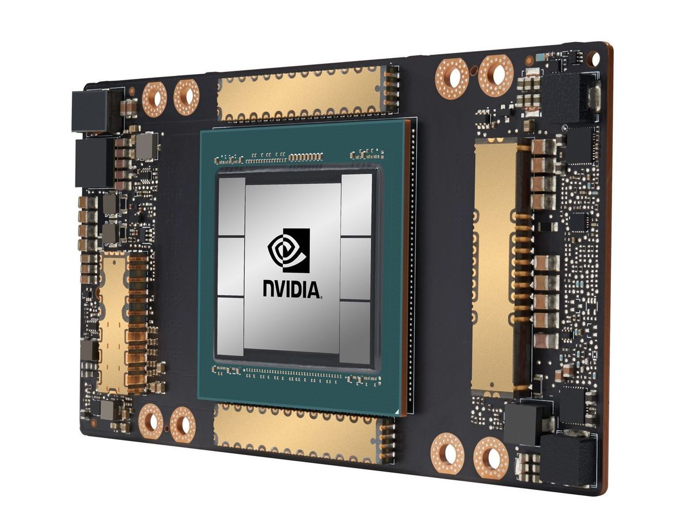
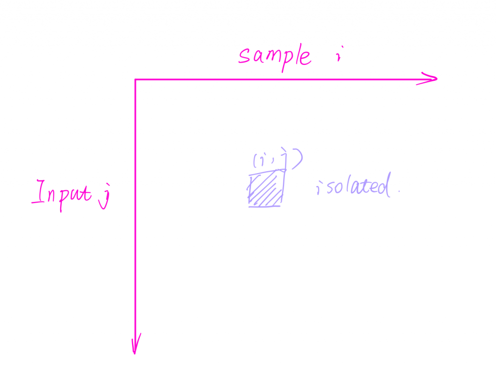
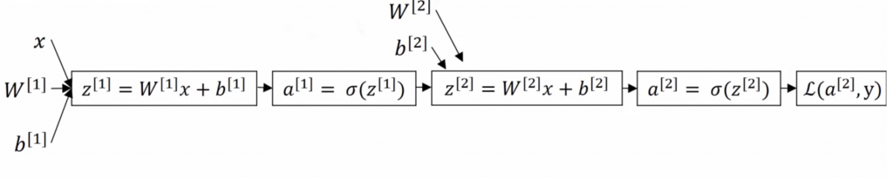
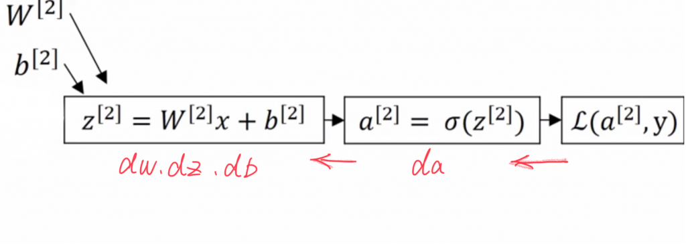
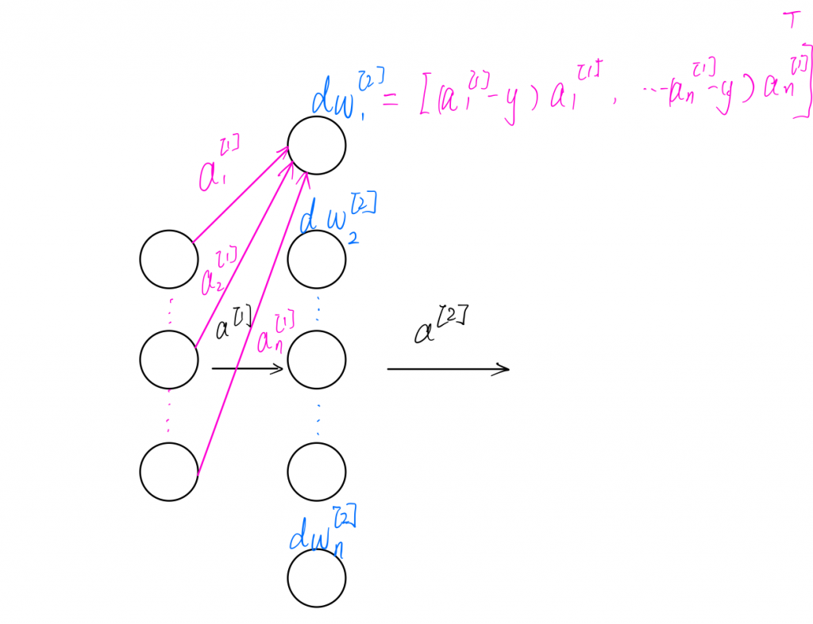
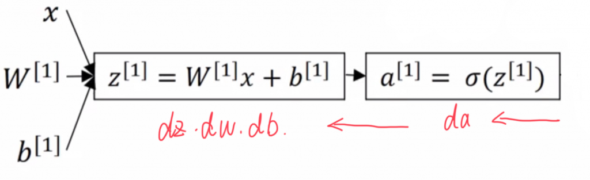
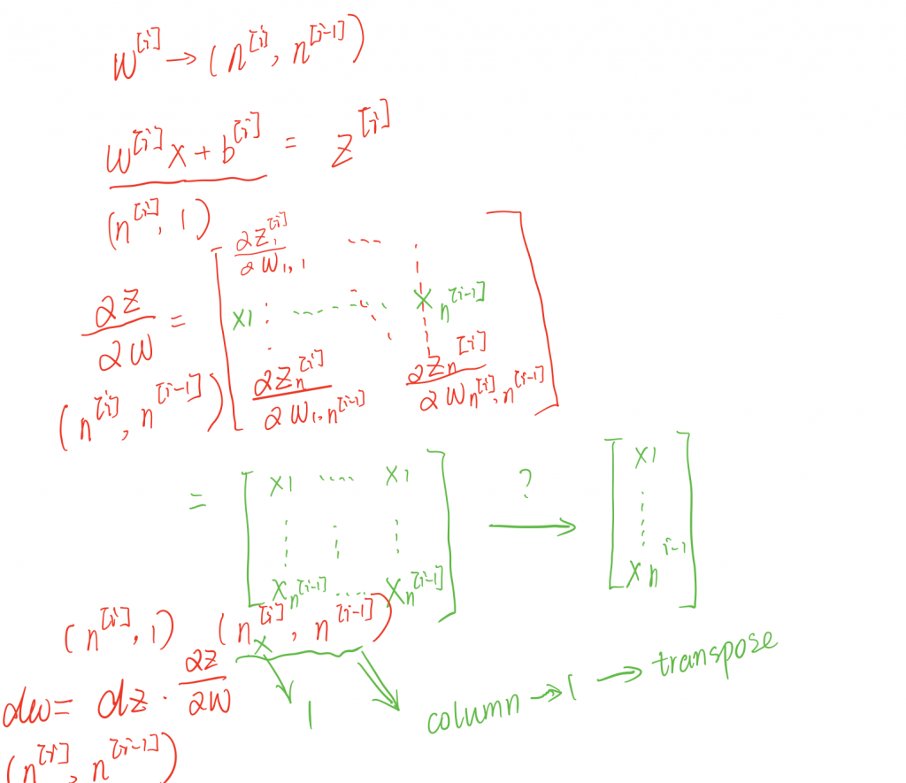

### Back Propagation

a single unit in each layer

\\begin{aligned}
dw=\\frac{\\alpha L(w)}{\\alpha w}
\\end{aligned}

multiple units in each layer

\\begin{aligned}
dw^{\[i\]} =&  \\frac{\\alpha L}{\\alpha w^{\[i\]}} =
\\begin{bmatrix}
\\frac{\\alpha L}{\\alpha w\_1^{\[i\]}}\\\\
\\frac{\\alpha L}{\\alpha w\_2^{\[i\]}}\\\\
\\vdots\\\\
\\frac{\\alpha L}{\\alpha w\_n^{\[i\]}}
\\end{bmatrix}

\\end{aligned}

Input multiple examples

dW^{\[i\]} =  \\frac{\\alpha L}{\\alpha W^{\[i\]}} =
\\begin{bmatrix}
\\frac{\\alpha L}{\\alpha w^{\[1\]}} \\cdots \\frac{\\alpha L}{\\alpha w^{\[m\]}}
\\end{bmatrix}

### Cost function

dW^{\[i\]} =  \\frac{\\alpha C}{\\alpha W^{\[i\]}} =\\frac{\\alpha (\\frac{1}{m}\\sum\_{j} L\_j)}{\\alpha W^{\[i\]}} =
\\frac{1}{m}\\sum\_{j}^{m}
\\frac{\\alpha L\_j}{\\alpha W^{\[i\]}}

The cost derivative is equivalent to averaging columns horizontally after stacking the samples in a matrix.

GPU acceleration

A two-layer neural network example

- loss function

L(a,y)=−yloga−(1−y)log(1−a)

\\begin{aligned} 
\\frac{\\alpha L(a,y)}{\\alpha a}
= & \\frac{\\alpha}{\\alpha a }(-yloga -(1-y )log(1-a ))
\\\\=  &-\\frac{y}{a }+\\frac{1-y}{1-a}
\\end{aligned} 

- activation function

\\sigma(z ) = \\frac{1}{1+e^{-x}}

\\begin{aligned} 
\\frac{\\sigma (z)}{\\alpha z}
= & \\frac{\\alpha}{\\alpha z }(\\frac{1}{1+e^{-x}})
\\\\=  &(\\frac{1}{1+e^{-x}})^{2}e^{-x}
\\\\=  &\\frac{1}{1+e^{-x}}\\frac{e^{-x}}{1+e^{-x}}
\\\\=  &\\sigma (z)(1-\\sigma (z))
\\end{aligned} 

## Layer 2

### da

len(a)

(n^{\[2\]},1)

\\begin{aligned}
da = & \\frac{\\alpha L(a,y)}{\\alpha a}
 \\\\= &-\\frac{y}{a }+\\frac{1-y}{1-a}

\\end{aligned}

da^{\[2\]} = -\\frac{y}{a^{\[2\]} }+\\frac{1-y}{1-a^{\[2\]} }

dA^{\[2\]} = -\\frac{y}{A^{\[2\]} }+\\frac{1-Y}{1-A^{\[2\]}}

## dz

len(z)

(n^{\[2\]},1)

\\begin{aligned}
dz = & \\frac{\\alpha L(a,y)}{\\alpha z}
 \\\\= & \\frac{\\alpha L}{\\alpha a} \\frac{\\alpha a}{\\alpha z} 
\\\\=  &(-\\frac{y}{a }+\\frac{1-y}{1-a})(a(1-a))
\\\\=  &a-y
\\end{aligned}

dz^{\[2\]} = a^{\[2\]} - y

dZ^{\[2\]} = A^{\[2\]} -Y

## dw

len(w)

(n^{\[2\]},n^{\[1\]})

\\begin{aligned}
dw = & \\frac{\\alpha L(a,y)}{\\alpha w}
 \\\\= & \\frac{\\alpha L}{\\alpha z} \\frac{\\alpha z}{\\alpha w} 
\\\\=  &(a-y)x

\\end{aligned}

dw^{\[2\] }= (a^{\[2\]}-y)(a^{\[1\]})^{\\intercal}

dW^{\[2\] }= (A^{\[2\]}-Y)(A^{\[1\]})^{\\intercal}

### db

len(b)

(n^{\[2\]},1)

\\begin{aligned}
db = & \\frac{\\alpha L(a,y)}{\\alpha b}
 \\\\= & \\frac{\\alpha L}{\\alpha z} \\frac{\\alpha z}{\\alpha b} 
\\\\=  &a-y

\\end{aligned}

db^{\[2\] }= a^{\[2\]}-y

dB^{\[2\] }= A^{\[2\]}-Y

## Layer 1

len(a)

(n^{\[1\]},1)

\\begin{aligned}
da = & \\frac{\\alpha L(a,y)}{\\alpha a}
 \\\\= &\\frac{\\alpha L}{\\alpha z} \\frac{\\alpha z}{\\alpha a} 
 \\\\= &(a-y)w

\\end{aligned}

da^{\[1\]} = (w^{\[2\]})^{\\intercal}(a^{\[2\]}-y)

dA^{\[1\]} = (W^{\[2\]})^{\\intercal}(A^{\[1\]}-Y)

### dz

len(z)

(n^{\[1\]},1)

\\begin{aligned}
dz = & \\frac{\\alpha L(a,y)}{\\alpha z}
 \\\\= & \\frac{\\alpha L}{\\alpha a} \\frac{\\alpha a}{\\alpha z} 
\\\\=  &w(a-y)(a(1-a))

\\end{aligned}

note: \* = element-wise operation

\\begin{aligned}
dz^{\[1\]} = &da^{\[1\]}\*\\frac{\\alpha a^{\[1\]}}{\\alpha z^{\[1\]}} 
 \\\\= &(w^{\[2\]})^{\\intercal}(a^{\[2\]}-y)\*(a^{\[1\]}\*(1-a^{\[1\]}))

\\end{aligned}

dZ^{\[1\]} =  (W^{\[2\]})^{\\intercal}(A^{\[1\]}-Y)\*(A^{\[1\]}\*(1-A^{\[1\]}))

### dw

len(w)

(n^{\[1\]},n^{\[0\]})

\\begin{aligned}
dw = & \\frac{\\alpha L(a,y)}{\\alpha w}
 \\\\= & \\frac{\\alpha L}{\\alpha z} \\frac{\\alpha z}{\\alpha w} 
\\\\=  &w(a-y)(a(1-a))x

\\end{aligned}

\\begin{aligned}
dw^{\[1\]} = &dz^{\[1\]}(\\frac{\\alpha z^{\[1\]}}{\\alpha w^{\[1\]}} )^{\\intercal}
 \\\\= &(w^{\[2\]})^{\\intercal}(a^{\[2\]}-y)\*(a^{\[1\]}\*(1-a^{\[1\]}))(a^{\[0\]})^{\\intercal}
\\end{aligned}

question about matrix calculus

dW^{\[1\] }= (W^{\[2\]})^{\\intercal}(A^{\[1\]}-Y)\*(A^{\[1\]}\*(1-A^{\[1\]}))

### db

len(db)

(n^{\[1\]},0)

\\begin{aligned}
db = & \\frac{\\alpha L(a,y)}{\\alpha b}
 \\\\= & \\frac{\\alpha L}{\\alpha z} \\frac{\\alpha z}{\\alpha b} 
\\\\=  &w(a-y)(a(1-a))

\\end{aligned}

same?

\\begin{aligned}
db^{\[1\]} = &dz^{\[1\]}\\frac{\\alpha z^{\[1\]}}{\\alpha b^{\[1\]}} 
 \\\\= &(w^{\[2\]})^{\\intercal}(a^{\[2\]}-y)\*(a^{\[1\]}\*(1-a^{\[1\]}))
\\end{aligned}

dB^{\[1\] }= (W^{\[2\]})^{\\intercal}(A^{\[1\]}-Y)\*(A^{\[1\]}\*(1-A^{\[1\]}))

## Generalization

For layer i the derivatives of parameters could be represented by simply 'd' notations.

\\begin{aligned}
dz^{\[l\]} =& da^{\[l\]}\*\\sigma'^{\[l\]}(z^{\[l\]})\\\\
dw^{\[l\]} =&  dz^{\[l\]}(a^{\[l-1\]})^{\\intercal}\\\\
db^{\[l\]} =&  dz^{\[l\]}\\\\
da^{\[l-1\]} =& (w^{\[l\]})^{\\intercal}dz^{\[l\]}
\\end{aligned}

\\begin{aligned}
dZ^{\[l\]} =& dA^{\[l\]}\*\\sigma'^{\[l\]}(Z^{\[l\]})\\\\
dw^{\[l\]} =&  dZ^{\[l\]}(A^{\[l-1\]})^{\\intercal}\\\\
db^{\[l\]} =&  dZ^{\[l\]}\\\\
dA^{\[l-1\]} =& (w^{\[l\]})^{\\intercal}dZ^{\[l\]}
\\end{aligned}

cost function

\\begin{aligned}
dZ^{\[l\]} =&dA^{\[l\]}\*\\sigma'^{\[l\]}(Z^{\[l\]})\\\\
dw^{\[l\]} =&  \\frac{1}{m} dZ^{\[l\]}(A^{\[l-1\]})^{\\intercal}\\\\
db^{\[l\]} =&   \\frac{1}{m}np.sum(dZ^{\[l\]},axis=1,keepdims=True)\\\\
dA^{\[l-1\]} =&(w^{\[l\]})^{\\intercal}dZ^{\[l\]}
\\end{aligned}

1/m is for cost average over different samples. A and Z are input and output respectively. Their dimensions are both (n, m) where n is the number of hidden units and m is the size of samples.

dZ and dA have already expressed each gradient(N, M) regarding sample M on unit N, so there’s no need to get the average across all sample columns, which will bring confusion as the new dimension will turn to (n, 1). It disagrees with dZ whose size is (n, m). We could infer the same result for dA as both dA and dZ are similar.

When we compute the cost gradient over a ‘parameter’ we intend to learn, like

\\frac{\\alpha C(w)}{\\alpha w} = \\frac{1}{M}\\sum\_M\\frac{\\alpha L\_M(w)}{\\alpha w} 

it turns out that those parameters such as ‘w’ and ‘b’ in ‘wx + b’ are where our interest lies in, and when it comes to dZ and dA, their gradients are temporary variables as we are inferring dw and db. As a result, we put 1/m over w, and b, but not for A and Z.

Notice, all hidden units’ weights in w are the same for all samples when we stack each of them into a single matrix A, so in this case, the letter stays unchanged ‘w’ against ‘W’, if they have shown up in this blog, you could treat them as equivalent. The statement above also reasons why there’s a single 1/m shown up in front of dw instead of plugging before np.sum(...). Anyway, you could write dw as 1/m np.sum(...), it will leads to the result above as every sample shares the weight vector.
